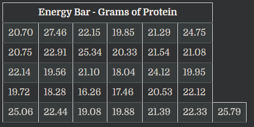
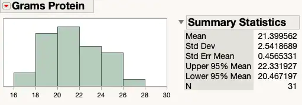

dalam T-test satu sample, data yang dipertimbangkan harus berasal dari 1) sample acak; 2) memiliki skala pengukuran metrik; 3) dan terdistribusi secara normal

jadi jika anda ingin mengetahui apakah suatu sample berbeda dengan populasi, anda harus menghitung T-test satu sample. tetapi sebelum itu sebuah pertanyaan dan hipotesis harus ditentukan terlebih dahulu.

misal pembuatan hipotesis, sebuah makanan X dalam labelnya memiliki kandungan protein 20 mg energy bar, kita ingin tahu apakah label tersebut benar atau salah.  tabel dibawah ini adalah 31 koleksi energi protein dari makanan X secara random

dilihat dari table, bahwa sebagian data menunjukkan energy dibawah 20 tetapi sebagian lagi diatas 20. sebagian akan setuju bahwa label tadi benar, tetapi sebagian orang tidak setuju kalau label tadi benar. perhitungan statistika memberikan pernyataan yang dapat lebih diterima.

misal pembuatan pertanyaan, apakah T-test merupakan metode yang tepat untuk menguji bahwa makanan X mengandung protein 20 gr energi?

nilai data bersifat independent, nilai data adalah gram protein, data makanan X adalah sample acak, sample terdistribusi secara normal. dari jawaban yang diberikan maka T-test merupakan metode yang diutamakan

dapat dilihat bahwa grafik tersebut memenuhi persyaratan distribusi normal, yaitu berbentuk seperti lonceng (walaupun kasar), ditandai dengan puncak lonceng berada pada kisaran rata-rata (21,399). pertanyaanya apakah nilai 21,399 ini membatalkan klaim dalam label bahwa makanan X mengandung protein 20 gr energi? atau tidak?

## perhitungan T-test
untuk perhitungan T-test, variable yang diperlukan adalah rata-rata, standar deviasi, dan ukuran sample.

pertama kita cari perbedaan antara rata-rata sample dengan hipotesis

	21,399 - 20 = 1.40

kemudian menghitung kesalahan standar untuk rata-rata, rumus daripada kesalahan standar adalah standar deviasi / akar jumlah sample

	2.54 / √31 = 0.456
	
kemudian masuk ke perhitungan T-test, dengan rumus perbedaan / standar error 

	1.40/0.456   = 3.07
	T            = 3.07

	
untuk membuat keputusan, akan dibandingkan statistik uji dengan nilai dari distribusi T 

- statistik pengujian adalah 3.07
- menentukan nilai resiko, yaitu 5%, berarti alfa = 0,05
- untuk T-test kita membutuhkan derajat kebebasan untuk menentukan nilai ini. derajat kebebasan adalah jumlah sample - 1 hasilnya adalah 30 

setelah didapatkan derajat kebebasan dan sudah ditentukan nilai resiko, kemudian dapat dilihat pada tabel [*](https://www.sjsu.edu/faculty/gerstman/StatPrimer/t-table.pdf)

nilai resiko direpresentasikan sebagai sumbu x, sedangkan derajat kebebasan direpresentasikan sebagai sumbu y. dari data yang diperoleh diatas, nilai resiko yaitu 0,05 dan derajat kebebasan yaitu 30, maka secara table nilai kritis T adalah +/- 2.043. orang orang statistik menulisnya dengan t0.05,30
 

setelah itu dibandingkan antara nilai statistik T dengan nilai kritis T yaitu 3.07 : 2.043. oleh karena T kritis lebih kecil secara statistik memolak bahwa dalam makanan X mengandung protein 20 gr energy. ditulis sebagai ***Ha : μ ≠ 20***

