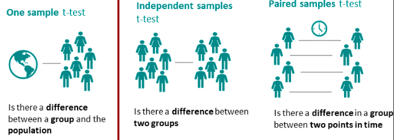

T-TEST menentukan apakah rata-rata sampel dan rata-rata populasi berbeda. one sample t-test merupakan keluarga t-test satu sample, jenis lainya adalah independent sample T-test ; dan paired sample T-test.

***

salah satu bagian penting dalam statistik adalah persoalan inferensi, yaitu penarikan kesimpulan secara statistik. One Sample T Test (Uji T Satu Sample) adalah uji komparatif untuk menilai perbedaan antara nilai tertentu dengan rata-rata kelompok populasi [*](http://staffnew.uny.ac.id/upload/198810132015041004/lainlain/WORKSHOP%20PEMANFAATAN%20BUKU%20AJAR%20STATISTIK%20TERAPAN%20DAN%20APLIKASI%20SPSS%20UNTUK%20MENINGKATKAN%20KOMPETENSI%20MENELITI%20BAGI%20GURU%20IPA%20TINGKAT%20SMP%20DI%20SLEMAN,%20YOGYAKARTA.pdf). One sample t-test merupakan salah satu test hipotesis paling umum di statistika

one sample t-test digunakan ketika ingin mengetahui apakah sample berasal dari populasi tertentu, tetapi tidak memiliki informasi populasi lenkap yang tersedia. misalnya kita mungkin ingin menetahui apakah sample mahasiswa tertentu serupa atau berbeda dengan mahasiswa pada umumnya

T-test satu sample digunakan untuk menguji apakah populasi berbeda dari nilai tetap. jadi pertanyaanya adalah apakah ada perbedaan yang significant secara statistik antara rata-rata sample dengan nilai tetap.

## contoh
1. contoh lain yang lebih konkrit adalah ketika ingin mengetahui apakah persepsi kesehatan para manajer di kanada berbeda dengan populasi secara keseluruhan. untuk tujuan ini anda bertanya kepada 50 menejer tentang persepsi mereka tentang kesehatan.

2. contoh lain anda ingin mengetahui apakah sekrup yang diproduksi perusahaan benar-benar memiliki berat rata=raa 10 gram. untuk mengujinya, timbang 50 sekrup dan bandingkan berat sebenarnya dengan berat yang seharusnya (10gram)

3. contoh lain sebauh perusahaan farmasi menjanjikan obatnya dapat menurunkan tekanan darah sebesar 10mmHg dalam satu minggu. ketika anda ingin mengetahui kebenaranya bandingkan penurunana tekanan darah yang diamati dari 75 subjeck uji dengan penurunan yang diharapkan sebesar 10mmHg

[*](https://www.researchgate.net/publication/363256658_The_Use_of_One_Sample_t-Test_in_the_Real_Data)