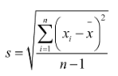
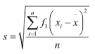

standar deviasi juga disebut dengan simpangan baku. standar deviasi adalah suatu nilai yang menunjukkan tingkat penyebaran data terhadap nilai rata-rata tersebut. standar deviasi juga dikenal dengan simpangan baku. jika standar deviasi lebih besar dari rata-rata (mean) artinya data semakin beragam dan jika lebih kecil dari rata-rata (mean) artinya data kurang beragam. 

fungsi standar deviasi adalah
1. memastikan sampel yang digunakan sudah mewakili populasi penelitian
2. menunjukkan tingkat keragaman data penelitian
3. tolok ukur keakuratan data dalam penelitian

### rumus standar deviasi tunggal

s : standar deviasi atau simpangan baku;
xi : data ke-i;
x : rata-rata (mean); dan
n : banyaknya data sampel.

### Rumus standar deviasi data berkelompok
Data berkelompok adalah data yang dinyatakan dalam bentuk interval, misalnya 22 – 25, 26 – 29, 30 – 33, dan seterusnya. Standar deviasi untuk data berkelompok bisa dicari dengan rumus berikut.

s : standar deviasi atau simpangan baku;
xi : data tengah (median dari tiap interval);
x :rata-rata (mean); dan
n : banyaknya data sampel.

Standar deviasi adalah penghitungan variabilitas yang menentukan lebar sebuah kurva distribusi normal. Standar ini dapat menghitung seberapa jauh kecenderungan data akan melebar dari nilai rata-rata yang menjadi titik pusatnya. Semakin kecil nilai standar deviasi, maka kurva akan berbentuk semakin runcing. Selain itu, standar deviasi juga menggambarkan jarak atau selisih umum antara mean dengan data lain yang diobservasi.

> Standard Deviasi dihitung dengan menu STDEV, tanpa huruf P di belakang. Jika dengan P maka yang dihitung adalah standard deviasi populasi