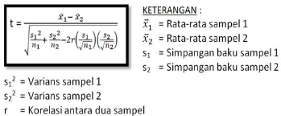
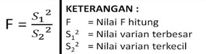
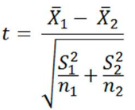

Bila seorang peneliti ingin mengetahui apakah parameter dua populasi berbeda atau tidak, maka uji statistik yang digunakan disebut uji beda dua mean. Umumnya, pendekatan yang dilakukan bisa dengan distribusi Z (Z-test), ataupun distribusi t (T-test).

Uji Z dapat digunakan bila (1) standar deviasi populasi (σ) diketahui, dan (2) jumlah sampelnya besar (> 30). Bila kedua syarat tersebut tidak terpenuhi, maka jenis uji yang digunakan adalah uji t dua sampel (two sample t-test).

T-test dua sample dibagi lagi menjadi 
1. dependent T-test (paired)
2. independent T-test

dikatakan dependent atau paired adalah ketika dua kelompok yang akan dibandingkan masih saling berkaitan.

contoh dari dependent T-test adalah membandingkan rata rata penjualan salesmen setelah mengikuti training dan sebelum mengikuti training. sedangkan contoh dari independent T-test adalah membandingkan rata-rata nilai eropsi dari lahan yang dilakukan konservasi dengan lahan yang tidak dilakukan konservasi. 

## rumus dependent T-test

## rumus independent T-test
sebelum menuju ke rumus independent T-test perlu dilihat perbedaan varians antara dua kelompok data yang akan diuji. karena ketika dinyatakan berbeda maka menggunakan rumus yang berbeda. atau dengan kata lain  harus diketahui apakah variannya sama (equal variance) atau variannya berbeda (unequal variance). rumus untuk menentukan 

Data dinyatakan memiliki varian yang sama (equal variance) bila F-Hitung < F-Tabel (kritis), dan sebaliknya, varian data dinyatakan tidak sama (unequal variance) bila F-Hitung > F-Tabel (kritis).
### rumus independent T-test sama varians

(Polled varians)

### rumus independent T-test sama varians

(unequal varians)

sumber[*](https://freelearningji.wordpress.com/2013/04/06/uji-t-dua-sampel/)
