it's about **Kuartil, Desil, Persentil** mereka adalah bilangan 'yang dianggap' dapat membagi data yang telah diurutkan besaranya

## Kuartil
ada tiga macam kuartil, yaitu kuartil pertama (Q1), kuartil kedua (Q2), kuartil ketiga (Q3). 
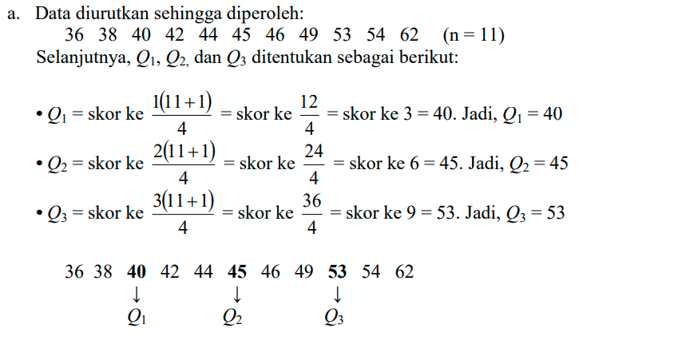
setiap pembatas kuartil bisa saja dalam bentuk desimal dan tidak eksis sebagai data yang tertera, seperti dibawah ini
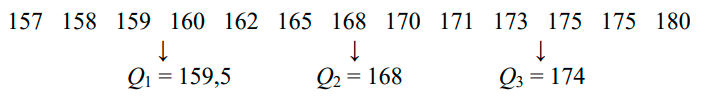

## Desil
ada sembilan macam desil, dimulai dari desil pertama (D1) sampai dengan desil kesembilan (D9). bentuk umum desil

misalnya

## Persentil
ada sembilan puluh sembilam macam persentil, dimulai dari persentil pertama (P1) sampai dengan persentil sembilan puluh sembilan (P99). bentuk umum persentil
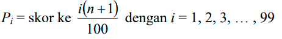

baik quartil, desil, dan persentil memiliki kesamaan cara perolehanya. 

## Menghitung Kuartil, Desil, dan Persentil dalam Tabel Distribusi Frekuensi
***
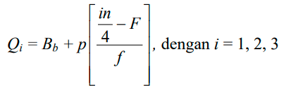
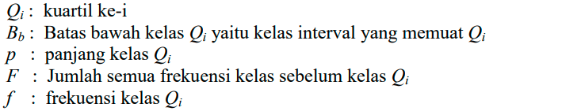

tinggal memasukkan saja nomornya kan, contoh lagi
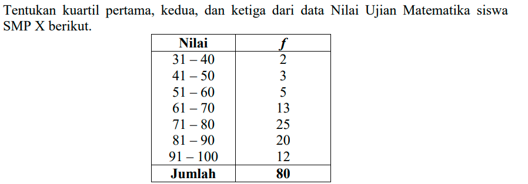
untuk memudahkan tambahkan kolom untuk menghitung frekuensi komulatif, yaitu frekuensi yang ditambahkan dengan frekuensi pada kelas sebelumnya
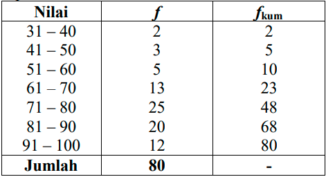
kemudian untuk menentukan kuartil pertama, masukkan dalam rumus berikut, jika ingin menemukan kuartik kedua, tinggal mengganti angka 1 dengan angka 2, berlaku juga untuk mencari kuartil ketiga
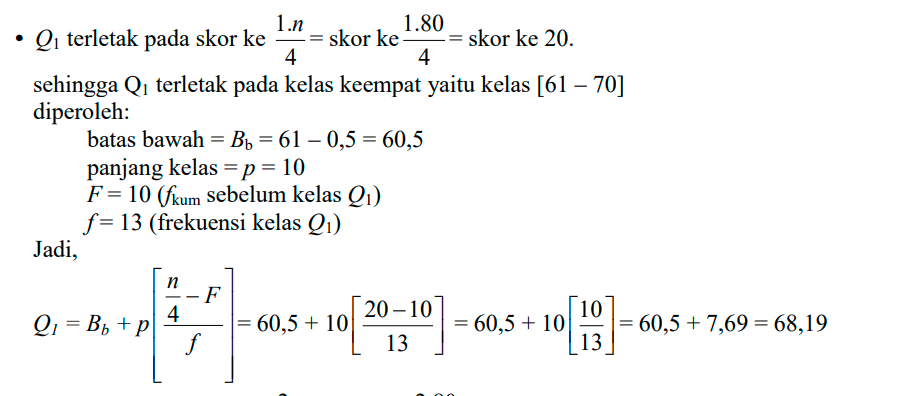

berikut untuk menghitung desil
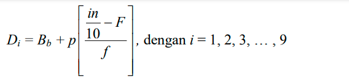
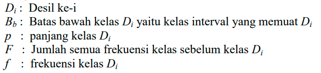

berikut untuk menghitung persentil
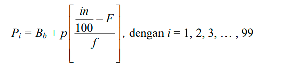
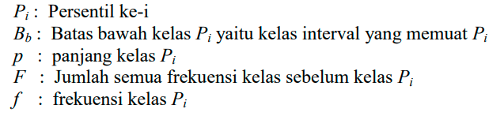