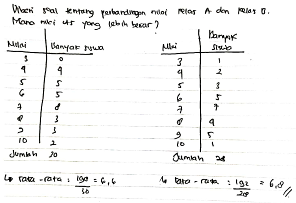
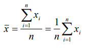
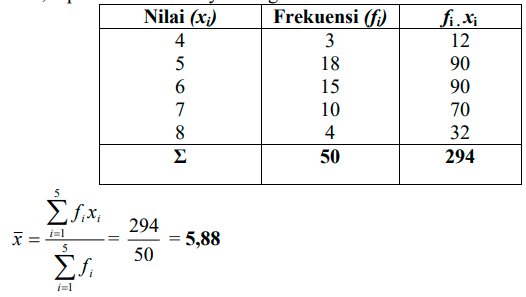
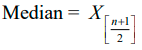
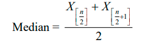
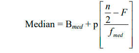
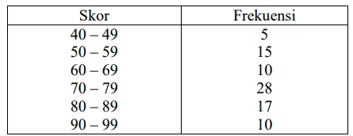
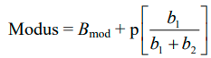
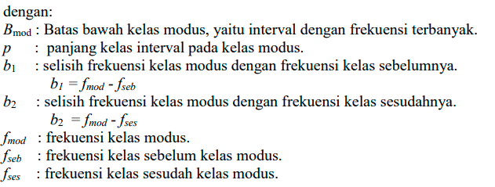
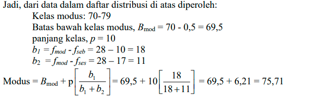

Rata-rata dibahasa dalam topik ukuran pemusatan data

> rata-rata = (Σx) / n

beberapa sifat rata-rata antara lain
1. rata-rata tidak mungkin lebih besar dari data terbesar. berlaku jua untuk terkecil
2. data ada yang lebih besar dari rata-rata namun tidak selalu, berlaku juga untuk data yang lebih kecil

menghitung rata-rata dengan terstruktur

contoh, data berat badan siswa 15 cowo dan 10 cewe berturut-turut adalah 50kg dan 45kg, tentukan berat rata-rata kelas tersebut:

( 15.50 + 10.45 ) / (15 + 10)

### Median
nilai tengah atau median. nilai tengah dalam distribusi data ketika data diurutkan dari nilai terkecil hingga terbesar (disebut statistik urutan). Jika jumlah data ganjil, median adalah nilai di tengah-tengah. Jika jumlah data genap, median adalah rata-rata dari dua nilai tengah.

notasi median dengan n ganjil

notasi median dengan n genap

mencari median dalam tabel distribusi frekuensi, diberikan data, carilah median dari data tersebut

ketika diketahui n = 82, maka medianya adalah n/2, yaitu nilai yang berada pada urutan ke 41. nilainya dapat diketahui melalui rumus sebagai berikut

Bmed, Batas bawah kelas median (kelas yang memuat median), 71,1 - 0,5 = 71,05
p, panjang kelas median, 7
n, jumlah semua frekuensi, 82	
F, jumlah semua frekuensi kelas sebelum kelas median, 5 + 16 = 21
fc, frekuensi kelas median, 40

### Modus
modus adalah data yang sering muncul atau dengan frekuensi paling tinggi. dalam satu data, ia dapat memiliki 1 modus, 2 modus, 3 modus, atau tidak sama sekali.

dikatakan tidak sama sekali, ketika frekuensi setiap nilai dalam data tersebut adalah sama. memiliki dua modus, yaitu ketika dalam data ada sebuah nilai yang memiliki nilai frekuensi yang sama. misal kasus yang sedikit rumit, diketahui data sebagai berikut

dalam bentuk seperti itu, modus sebenarnya tidak dapat dicari, hanya dapat menetapkan bahwa kelas yang memiliki frekuensi tertinggi disebut dengan **kelas modus**. modus sebenarnya terdapat dalam kelas tersebut yang dapat ditentukan dengan rumus berikut

> modus suatu data tidak selalu berupa bilangan

