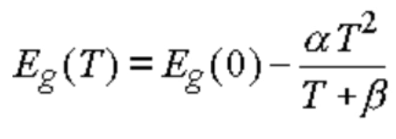

How does temperature affect the band gap? As temperature increases, the band gap energy decreases because the crystal lattice expands and the interatomic bonds are weakened. 

fungsi energi terhadap temperature dituliskan sebagai berikut 

ketika temperatur turun maka band gap energi naik, dengan kata lain temperatur turun panjang gelombang turun (energi tinggi). 

