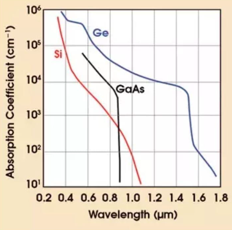
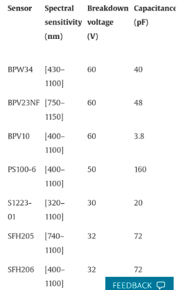
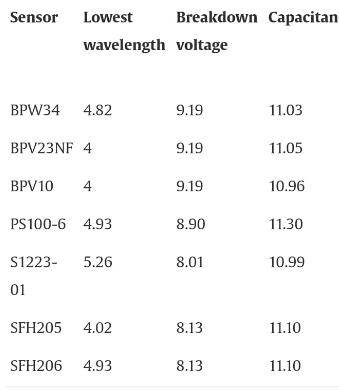

Germanium diodes are used as the solar cells responsible for absorbing the IR light and converting it into electricity. 

suhu akan mempengaruhi range elektromagnetik yang dapat diterima suatu semikonduktor. Because germanium has relatively low band gap, these detectors must be cooled in order to reduce the thermal generation of charge carriers to an acceptable level.

dibawah ini adalah model sensor beserta spesifikasinya. 

yang paling terkenal sepertinya adalah BPW34. artikel ilmiah berbahasa indonesia tersedia [*](http://etd.repository.ugm.ac.id/penelitian/detail/207102#filepdf) 

> photodioda dan FM receiver berbeda cara kerja

