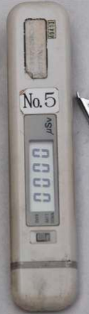
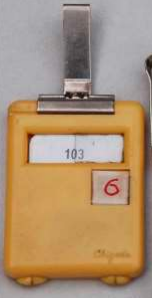

### Dibawah adalah beberapa alat untuk mengukur tingkat radiasi

1. Dosimeter personal

diatas adalah dosimeter yang menghitung secara realtime, berarti tidak dapat dihitung untuk mengakumulasi (lifetime) misalnya untuk satu bulan

dosimeter diatas adalah alat ukur yang dapat mengukur secara komulatif. 
2. Monitor area
3. Monitor kontaminasi
4. Sistem pencacah radiasi

