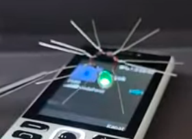

rangkaian penangkap gelombang elektromagnetik dapat dilihat pada sumber youtube berikut ini [*](
https://youtu.be/XpLCK88nVgU)

rangkaian radio paling ringkas dapat dilihat disini [*](https://www.youtube.com/watch?v=GdvKDFz9Xi4)
rangkaian pemancar radio pada 10 MHz, ringkas [*](https://youtu.be/7MavXzTjP04)

rangkaian radio receiver with germanium diode [*](https://www.youtube.com/watch?v=DtIoUX725Jk) it is use IN34 or IN34A and free battery. 

rangkaian pendektesi frekuensi radio dari cell phone, ketika melakukan panggilan [*](https://youtu.be/xgIL81VSKX4)

anti ganci hilang, dengan memanfaatkan gelombang suara frekuensi tinggi (bunyi siul) dan ditangkap sebagai mestinya [*](https://youtu.be/cQifbc_xJK8)

tanpa battery, mengandalkan energi elektromagnetik dari cell phone tanpa komponen tambahan, hanya menggunakan dioda [*](https://www.youtube.com/shorts/bGeJJ0p3La8)
