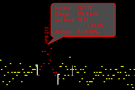

## Calibration
kalibrasi diperlukan untuk memetakkan puncak-puncak pada channel yang sesuai. kalibrasi adalah syarat sebuah nuklida dapat diidentifikasi dan hasil perhitungan ROI ditampilkan. ketika spektra hasil maestro (ADCAM) kemudian dibuka di software genie juga akan sedikit pergeseran karena berbeda software, sehingga perlu dikalibrasi khususnya untuk analisis kualitatif. kalibrasi dapat menggunakan parameter alam, yaitu pada energi
- 511 KeV 
- 583,3 KeV 
- 1460,8 KeV 

ketiga energi tersebut adalah sumber radioaktif yang pasti terdapat di alam, salah satunya adalah energi 1460,8 KeV yang dimiliki oleh K-40. cara kalibrasinya adalah pada bar calibrate > energy only calibrate 

1. cari sekitaran energi referensi berada
2. identifikasi count tertinggi
3. catat channel dimana count tertinggi berada
4. masukkan energi referensi pada channel tersebut


misalnya, cari energi 1460, 8 KeV berada, cari count tertinggi pada sekitaran energi tersebut akhirnya masukkan energi tersebut di channel diaman count tertinggi. kemudian pilih accept, untuk melihat plotting pilih show. 

pada software genie minimal kalibrasi adalah 3 sumber standar sedangkan pada maestro minimalnya adalah 1 sudah cukup. idealnya 3 sumber mewakili energi tingkat rendah, energi tingkat sedang, dan energi tingkat tinggi dan ketika di plot akan membentuk garis lurus. 

## Report Net Area
Net area adalah luasnya puncak yang ditandai dengan ROI, penandaan dapat dilakukan secara manual mapun otomatis, tetapi dengan otomatis membuatnya tidak begitu akurat. 

arahkan kursor ke peak, kemudian pencent	```ctrl + insert```  itu akan membuat penanda ROI mendekat, setelah melakukan ROI otomatis anda dapat menyesuaikan (manual) posisikan batas tepat di kaki-kaki puncak seperti gambar diatas, setelah itu pencet  ```insert```. tetapi sebelum itu lakukan delete terlebih dahulu terhadap ROI otomatis tadi. penghapusan ROI harus sesuai persis dimana ROI berada.

untuk melihat nuclidenya sekilas dapat dengan display > preference > ceklist display nuclide ID pilih ascending dan peak info pilih Library lines.

untuk mencetak nuclidenya, 
1. analyze > peak locate user specified > execute
2. analyze > peak area > sum / non linear LSQ > execute 
3. analyze > nuclide identification > pilih stdlib.nlb dan checklist generate report stdlib berada di folder root genie/CAMFILES
4. file > export report to PDF

