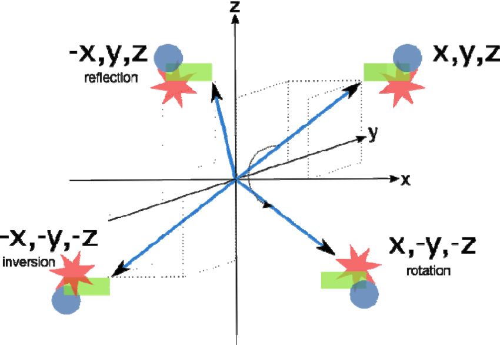

Operasi simetri molekul dapat digunakan untuk memprediksi banyak sifat kimia molekul misalnya untuk memprediksi momen dipole suatu molekul, simetri juga berguna dalam studi orbital molekul. Salah satu teknik untuk menentukan simetri molekul tertentu adalah kristalografi sinar-X.

## 1. Inversion center
Dalam inversi melalui pusat simetri, i (elemen), kita bayangkan mengambil setiap titik dalam sebuah molekul dan kemudian memindahkannya dengan jarak yang sama di sisi lain. Singkatnya, operasi inversi memproyeksikan setiap atom melalui pusat inversi dan keluar dengan jarak yang sama di sisi yang berlawanan.

## 2. Reflection 
bidang cermin vertikal, yang ditunjukkan dengan subskrip "v" (σ v ). 

## 3. Rotasi tepat
adalah rotasi 360°/ n , dilakukan m kali (apabila m =1 maka dapat tidak dituliskan). Jadi misalkan C34 maka atom C akan berputar 90 (360/4) derajat sebanyak 3 kali

## 4. Rotasi tidak tepat
Rotasi tidak tepat adalah kombinasi antara rotasi tepat dan refleksi

## Kesimpulan
