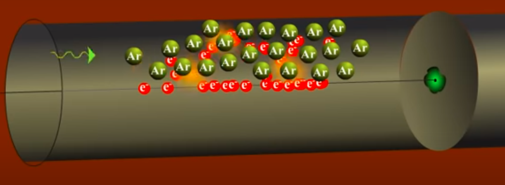

BATAN memiliki spektroskopi yang dapat mengukur gross beta. gross beta adalah jumlah total partikel beta, tidak peduli dari berasal dari atom apa. sedangkan spektroskopi gamma dapat mengidentifikasi nuklida dari atom apa. 

### Geiger-muller counter
gross beta didektesi pencacah Geiger Muller. Pencacah Geiger-Müller adalah sebuah alat pengukur radiasi ionisasi. Pencacah Geiger bisa digunakan untuk mendeteksi radiasi alpha dan beta. pada alat diperlukan tegangan (voltase) 1.27. pada layar monitor mwnynjukkan angka 3.1 yang artinya 3.10^1. satuan dari analit air adalah Bq(Bacquarel)/liter, satuan analit tanah adalah Bq/gram, satuan analit dari rumput (abu) adalah Bq/gram abu. 

Sensornya adalah sebuah tabung Geiger-Müller, sebuah tabung yang diisi oleh gas yang akan bersifat konduktor ketika partikel atau foton radiasi menyebabkan gas inert (umumnya Argon) menjadi konduktif. geiger muller tube disebut juga dengan geiger counter

gas inert terionisasi menyebabkan elektronya berhamburan, hamburan elektron kemudian dimanfaatkan untuk mengalirkan litrik antara katoda-anoda yang selanjutnya diidentifikasi untuk merepresentasi dari radiasi beta. 

### Gamma spectroscopy
Sebagian besar sumber radioaktif menghasilkan sinar gamma, yang memiliki berbagai energi dan intensitas. Ketika emisi ini terdeteksi dan dianalisis dengan sistem spektroskopi, spektrum energi sinar gamma dapat dihasilkan. Sinar gamma adalah bentuk energi tertinggi dari radiasi elektromagnetik. Detektor spektroskopi gamma adalah bahan pasif yang mampu berinteraksi dengan sinar gamma yang masuk.

spektroskopi gamma membutuhkan nitrogen cair untuk mendinginkan sample, oleh alasan tersebut juga ruangan spektroskopi gamma dibuat dingin sehingga nitrogen cair tidak mudah menguap. BATAN memiliki dua perangkat spektroskopi yaitu maestro gan genie, dalam pengaturan kalibrasi genie perlu mengatur channel dan energynya sedangkan maestro hanya perlu mengatur energynya saja. dan maestro ini ada shieldingnya sehingga akan meminimalisir radiasi latar (blanko).

***
analisis kualitatif menggunakan spektroskopi ini mencakup apa jenis nuklidanya. sedangkan analisis kuantitatif meliputi kadar / tingkat radioaktif atau aktivitas sinar gamma. 

kalibrasi energi diperlukan untuk melakukan analisis kualitatif, kalibrasi efisiensi dilakukan untuk melakukan analisis kuantitatif. 
