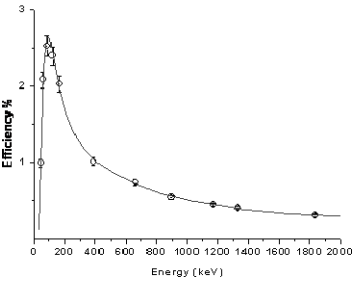
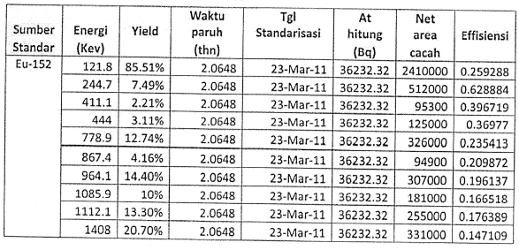
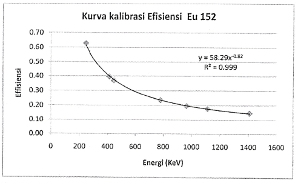

efisiensi adalah parameter yang diperlukan dalam menentukan aktivitas suatu material, efisiensi adalah representasi seberapa efisien energi mengenai suatu material. misalnya dalam instrumen spektroskopi geiger muller, semakin tebal suatu material maka sebenarnya yang berinterasi dengan detektor hanyalah permukaanya, sehingga efisiensiya rendah. walapun begitu detektor mempunyai limit detection (LD) yaitu batas minimal detektor dapat bekerja terhadap material. ketika material tidak mencapai batas minimal maka detektor tidak dapat mendektesinya berarti memiliki efisiensi yang rendah. dibawah ini adalah contoh salah satu grafik dari kalibrasi efisiensi spektroskopi gamma suatu material

dalam gambar diatas, terdapat beberapa node node yang merupakan representasi dari material standar yang dikenai variasi energi. dari node tersebut dibuat plot garis, plot garis dapat berupa regresi, baik model regresi exponential, regresi linear atau lainya dengan pertimbangan semakin menyinggung semua node, maka semakin bagus model tersebut, ketika R menyentuh angka 1 maka itu semakin sempurna. dari plot ditarik persamaan regresi, dengan mensubstitusi variable x, maka didapatkan nilai y atau nilai effisiensi. 

contoh kalibrasi efisiensi menggunakan sumber Eu-152

 dari data kemudian dianalisis menggunakan software Microsoft Exel sehingga didapatkan seperti berikut
 
 persamaan diatas kemudian digunakan untuk menentukan nilai efisiensi dari masing masing radionuklida (nilai Y), yaitu dengan memasukkan nilai energi (nilai X), maka besarnya efisiensi dari masing - masing nuklida dapat diketahui