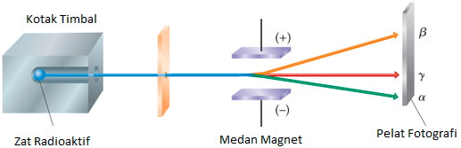

sinar radioaktif secara garis besar terdiri dari sinar gamma, alfa dan beta. 

dari gambar tersebut dapat didimpulkan bahwa sinar beta bermuatan negatif, gamma tidak bermuatan, dan alfa bermuatan positif. penelitian selanjutnya mengungkapkan bahwa 
1. sinaf alfa : inti helium 
2. sinar beta : elektron 
3. sinar gamma : radiasi elektromagnetik (energi diatas X-ray)

sinar alfa dibelokkan oleh medan listrik dan magnet, memiliki massa yang besar sehingga pembelokanya tidak terlalu tajam dibandingkan dengan sinar beta dan memiliki daya tembus kecil tetapi energi kinetik besar. perbedaan utama sinar-x dan sinar gamma adalah sinar gamma dihasilkan dari release energy inti atom, sedangkan sinar-x dihasilkan dari release energy elektron atom.