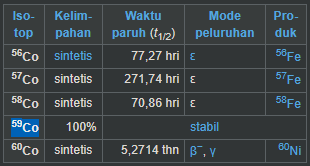
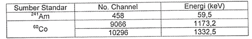
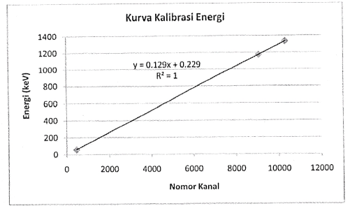

analisis kualitatif menggunakan spektroskopi ini mencakup apa jenis nuklidanya. sedangkan analisis kuantitatif meliputi kadar / tingkat radioaktif atau aktivitas sinar gamma.

kalibrasi energi diperlukan untuk melakukan analisis kualitatif, kalibrasi efisiensi dilakukan untuk melakukan analisis kuantitatif.

kalibrasi spektroskopi mengunakan material yang sudah ada preferensinya misalnya amirisium 241 dan cobalt 60

Cobalt 60 adalah cobalt tidak stabil dari cobalt 59. Cobalt-60 (60Co) is a synthetic radioactive isotope of cobalt with a half-life of 5.2713 years

nomor atom atau nomor proton dapat disebut sebagai nomor identitas, karena nomor proton digunakan sebagai id pada table periodik unsur.
1. Cobalt-60 artinya terdiri dari 33 proton dan 27 neutron
2. Cobalt-59 artinya terdiri dari 33 proton dan 26 neutron

pencacahan sumber seperti cobalt-60 cukup dilakukan selama 5 menit karena mudah sekali untuk mendektesi aktivitasnya. setiap nuklida memiliki beberapa energi, jadi ketika dalam spektrum energi, ada serapan energi yang oleh mesin penganalisis ditunjukkan dua jenis nuklida, anda sebagai seorang analis harus menentukan dari beberapa serapan energi sebenarnya mana yang asli yaitu dapat dilihat dengan energi lain dari nuklida tersebut. misalnya nuklida Cu memiliki energi 
1. 302.2
2. 402
3. 423.1
4. 434

sedangakan nuklida Pb memiliki energi
1. 324.3
2. 402
3. 543.3
4. 554.1

misal kasusnya ada serapan energi nuklida 402 dan oleh si mesin ditunjukkan bahwa energi 402 merupakan nuklida Cu dan Pb. maka kita cari lagi adakah serapan energi nuklida Cu yang lain atau adakah serapan energi nuklida Pb yang lain. semisal ternyata ada serapan energi nuklida 423.1 dan ada juga serapan energi nuklida 434 maka itu kemungkinan adalah nuklida Cu. 

Data standar untuk kalibrasi energi 

data tersebut apabila dibuat kurva maka didapatkan ilustrasi dibawah ini

grafik diatas berupa garis lurus yang memenuhi persamaan linear Y = a + bX, dan didapatkan persamaan linear dari sebagai berikut

**Energi = (0,129*No. Kanal + 0,229) keV**

Hubungan antara Nomor kanal dengan tingkat energi sangat erat (baik) hal ini ditunjukkan dengan nilai R.R adalah 1. dengan menggunakan software Genie kalibrasi dapat dilakukan degan input energi dan No. Kanal
