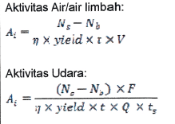
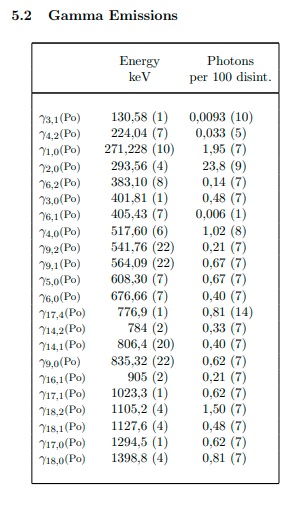
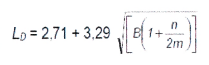

menghitung aktivitas sample dengan spektroskopi gamma, didasarkan bahwa kebanyakan unsur radioaktif memancarkan sinar gamma dengan berbagai variasi dan intensitas. dengan spektroskopi gamma, pancaran sinar gamma dari mateiral radioaktif tersebut ditangkap oleh suatu detektor.

$$ A_{i} = \frac{N_{s} - N_{b}}{n \cdot yield \cdot t \cdot V }$$

keterangan :
Ns : cacah sample
Nb : cacah background
n : efisiensi
yield : probabilitas pancaran gamma
t : lama waktu pencacahan
ts : lama sampling
Q : debit udara
F : perbandingan luas total filter : luas sample filter
V : volume sample

Ns dikurangi dengan Nb bertujuan untuk memperoleh netto cacah. mencari efisiensi adalah dengan memasukkan energi pada yield tertentu (ambil yang mempunyai yield besar) kedalam persamaan efisiensi spektroskopi gamma yang telah dikalibrasi. penjelasan F dan Q ada di book kuantitatif Geiger-Muller 

perlu diperhatikan bahwa nilai energi dari yield yang diambil silahkan berpedoman pada referensi [lnhbr](http://www.lnhb.fr/nuclear-data/nuclear-data-table/). cari unsur yang dihendaki, kemudian pencet tombol 'T'. misalnya untuk atom unsur Bi-215

dalam dokumen yang telah didownload pada bagian emisi gamma terdapat banyak energi dengan pasangan yieldnya diantaranya 
1. 130,58
2. 224,04
3. 271,228
4. ...

yield sama dengan photond per 100 disint. itu merepresentasikan tingginya puncak, semakin tinggi nilainya maka semakin mudah diamati. angka belakang yang berada dalam tanda kurung tersebut adalah rendah ketidakpastianya. yield dapat berupa persen, yaitu dengan mengalikanya dengna 100, artinya ketika yield bernilai 1 atau 100% maka peak akan menyentuh batas atas grafik.

Limit Detection untuk spektroskopi gamma
