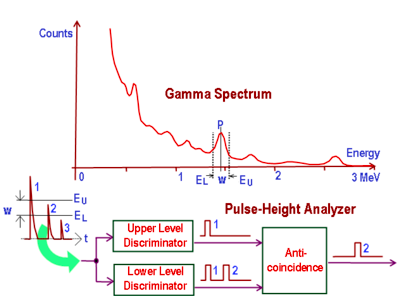

komponen utama spektroskopi gamma adalah detektor radiasi peka energi dan perangkat elektronik penyortir pulsa. Tegangan sinyal yang dihasilkan sebanding dengan energi sinar gamma yang terdeteksi. Hasil pencacahan berupa jenis isotop / radionuklida dan data cacah (net area)

## Detektor
Bahan detektor umum termasuk natrium iodida (NaI) atau Germanium dengan kemurnian tinggi. Mekanisme yang terjadi dengan detektor adalah efek fotolistrik; efek compton; dan produksi pasangan (pasangan matter-antimatter). Melalui proses ini, energi sinar gamma diserap dan diubah menjadi sinyal tegangan dengan mendeteksi perbedaan energi sebelum dan sesudah interaksi

Efek fotolistrik, adalah ketika suatu material (umumny a logam) dikenai sebuah gelombang elektromagnetik (salah satunya gelombang gamma / gamma ray), maka ia akan melepaskan suatu elektron, ini dimanfaatkan dalam panel surya. setiap material memiliki range energi efektif agar ia dapat melepaskan elektron ke elektroda laiya

Efek compton, adalah fenomena yang diamati pada sinar-x atau sinar gamma yang mengalami perubahan nilai gelombang ketika mengenai elektron bebas suatu material.

Produksi pasangan adalah proses di mana sinar gamma dengan energi yang cukup diubah menjadi elektron dan positron.

## Multi Channel Analyser (MCA)
Pulsa tegangan yang dihasilkan untuk setiap sinar gamma yang berinteraksi dalam volume detektor kemudian dianalisis oleh multichannel analyzer (MCA). 

Transien adalah gejala peralihan, yakni perubahan nilai tegangan atau arus maupun keduanya yang terjadi dalam waktu sesaat (dalam orde miikrodetik) 

(fungsi gauss)

Setiap saluran mewakili rentang energi tertentu dalam spektrum, jumlah sinyal yang terdeteksi untuk setiap saluran mewakili intensitas spektral radiasi dalam rentang energi ini. Dengan mengubah jumlah saluran, dimungkinkan untuk menyempurnakan resolusi dan sensitivitas spektral. 

## Resolusi detektor
Angka paling umum yang digunakan untuk menyatakan resolusi detektor adalah lebar penuh pada setengah maksimum (FWHM).

## Efisiensi detektor
Detektor dengan efisiensi tinggi menghasilkan spektrum dalam waktu yang lebih singkat daripada detektor dengan efisiensi rendah. Efisiensi detektor diukur dengan membandingkan spektrum dari sumber aktivitas yang diketahui dengan laju hitungan di setiap puncak dengan laju hitungan yang diharapkan dari intensitas yang diketahui dari setiap sinar gamma.