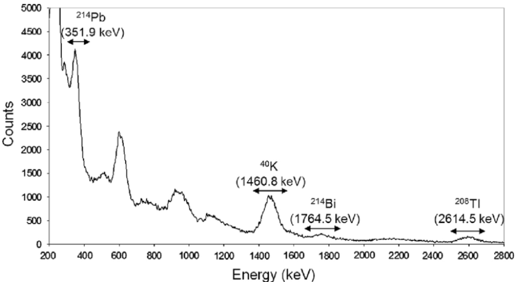

menggunakan persamaan peak to peak. dari beberapa standar uranium yang diperoleh dua diantaranya adalah CRM 1-A dan CRM 3-B yang sama sama sudah diketahui nilai kuantitatifnya. salah satu darinya akan digunakan sebagai material standar, sebut saja CRM 1-A sebagai material standar sehingga CRM 3-B digunakan seolah-olah sebagai sample (karena sebenarnya sudah diketahui analisis kuantitatifnya)

dengan menggunakan asas-asas statistika, akan ditinjau hasil uji yang diperoleh dari uji perhitungan CRM 3-B dengan standar CRM 1-A dibandingkan dengan referensi  CRM 3-B yang sudah ada, dalam hal ini yang dibandingkan adalah kadar. rumus yang digunakan adalah 

***Kadar sample = (Net area sample / Net area standar) * kadar standar***

dari pengujian spektroskopi gamma kadar sample CRM 3-B akan didapatkan, maka akan kita bandingkan dengan kadar sample  referensi CRM 3-B, kalau secara logis seharusnya adalah sama. pengujian perlu dilakukan sebanyak 10x untuk meminimalisir kesalahan, jika antar data memiliki perbedaan signifikan, maka ada ketidaktelitian atau sebagainya. 

Net area diperoleh dengan mengghitung dibawah ini

dalam gambar ditunjukkan bahwa puncak (ROI) yang terkait dengan peluruhan berbeda-beda dari setiap jenis nuklida tertentu.

