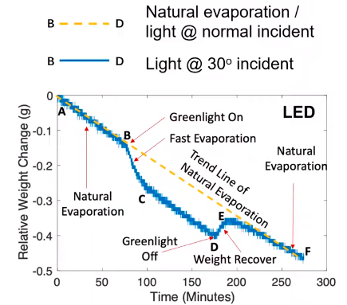
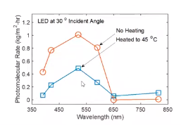

cahaya dapat mengakibatkan evaporasi pada air

dalam pengamatan di laboratorium yang dilakukan MIT baru-baru ini 2022. di alam, misalnya dilaut meskipun panas memainkan peran besar dalam evaporasi. 

pada gelombang cahaya tampak hijau (550nm) terjadi evaporasi yang maksimal