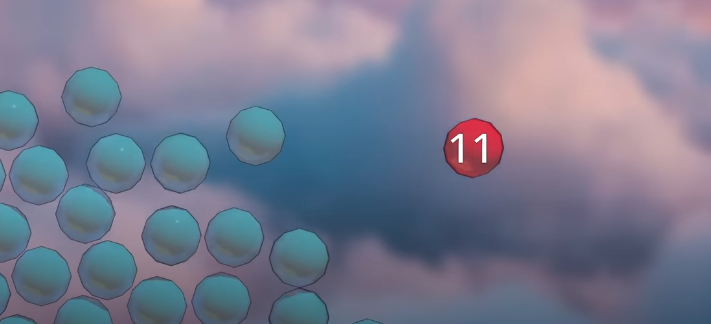

molekul air saling bertumbukan. mereka memiliki energi kinetik masing masing. misalnya dalam ikatan air, agar dapat keluar dari gerombolannya (evaporate) ia memerlukan energi yang lebih tinggi, katakanlah 10

dengan memberikan panas atau energi kepada molekul tersebut, berarti molekul tersebut akan memiliki energi kinetik yang lebih besar. 

semenjak molekul memisahkan diri dari interaksi sebelumnya, molekul tersebut masih tetap bercollision, membuat energi kinetik semakin berkurang untuk melakukan hal tersebut, ketika energi kinetik rendah maka disebut dengan kondensasi. 

exactly, dalam botol aqua anda, terjadi kesetimbangan air menguap dan mengkondensasi. laju kondensasi akan sama dengan laju evaporasi. 