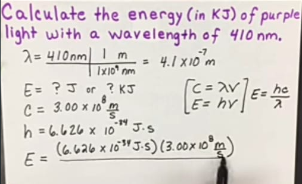

Elektron volt (eV) adalah satuan yang sangat kecil dari energi. karena fakta bahwa satuan standar energi- yaitu joule, adalah terlalu besar untuk memiliki makna yang jelas dalam penelitian satuan tingkat dasar, satu elektron volt dihitung sebagai 1,602 x 10-19 joule. Nilai ini berasal dari energi yang diperlukan untuk memindahkan elektron tunggal melalui potensial listrik satu volt, atau sebagai jumlah yang setara dengan energi untuk membawa satu foton cahaya KeV dapat di konversi ke KJ, dimana KJ terlalu besar untuk mendiskripsikan energi. 

