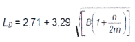

1. presisi, presisi atau keterulangan merepresentasikan bagaimana sebuah data saling berdekatan. menggunakan T-test untuk menentukan rata-rata sample terhadap populasi (standar) atau menggunakan Relative Standard Deviation (RSD). 
3. bias / akurasi, akurasi menggambarkan kedekatan suatu data terhadap nilai asli. Penilaian bias/akurasi harus dilakukan melalui penggunaan bahan referensi bersertifikat (CRM), perhitungan secara statistik dapat menggunakan z-score atau lainya, khusus z-score, For │Z│ values lower than or equal to 2, the result is satisfactory; for │Z│between 2 and lower than or equal to 3, questionable; for │Z│ greater than 3, the result is unsatisfactory.
4. Limit of Detection (LD), limit detection menggambarkan batas minimal spektroskopi dapat mendektesi aktivitas radionuklida. LD dihitung sebagai dengan rumus sebagai berikut 
 
(Gilmore, Gordon R., 2008)

6. spesifisity, 
7. robustness ( kekokohan )
8. Reproducibility (reproduktivitas )