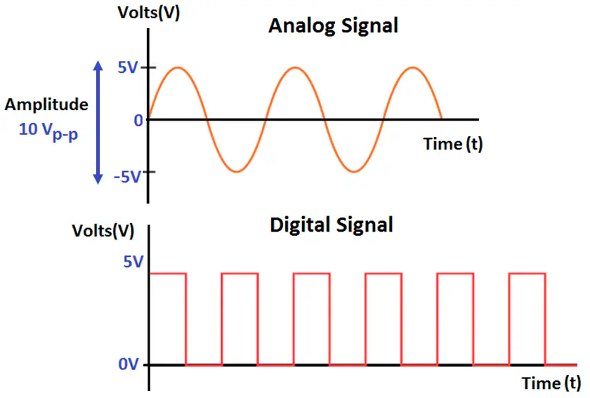

**singal analog** ditandai pada setiap perubahan singal didasarkan fungsi waktu maupun volts yang memiliki nilai sehingga bersifat kontinu, bahkan pada interval limit mendekati nol
$$ \lim_{x \to 0} $$

Operasi matematika yang sering digunakan dalam singal analog adalah integral
 $$ \int $$ 
 
**singal digital** ditandai pada setiap perubahan singal didasarkan fungsi waktu maupun volts yang belum tentu memiliki nilai sehingga bersifat diskret. ketika dibutuhkan nilai yang sebenarnya singal tersebut tidak memilikinya, maka hanya mengambil interpolasi atau rata rata dari singal n+1 dan n-1. Operasi matematika yang sering digunakan dalam singal digital adalah penjumlahan
$$  \sum_{}$$

*Gambar 1. Singal Analog dan Digital*