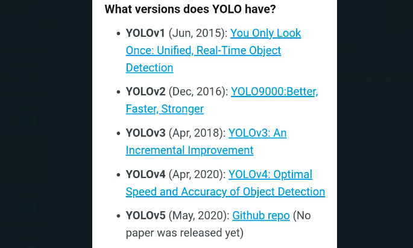

Before YOLO, the two-stage object detection architecture dominated the field. below is YOLO released version before

YOLO adalah adalah project sourcode, sehingga seseorang bisa mengambil repositori dan mengembangkanya sendiri, oleh sebab itu ada beberapa versi. sehingga ada YOLO yang dikembangkan secara official dan ada yang dikembangkan secara unofficial, as a note that MT-YOLOv6 is not part of the official YOLO series. 

It’s similar to YOLOv4 but uses a different framework, PyTorch, instead of DarkNet. However, the creator of YOLOv4, Alexey Bochkovskiy provided benchmarks comparing YOLOv4 vs. YOLOv5, showing that v4 is equal or better. Another example is YOLOv6 which was published by the Chinese company Meituan (hence the MT prefix of YOLOv6). And there is also an unofficial YOLOv7 version that was released in the year before the official YOLOv7 (there are two YOLOv7’s). Both YOLOv5 and YOLOv6 are not considered part of the official YOLO series but were heavily inspired by the original one-stage YOLO architecture

comparison with YOLOv4, YOLOv7 reduces the number of parameters by 75%, requires 36% less computation, and achieves 1.5% higher AP (average precision).