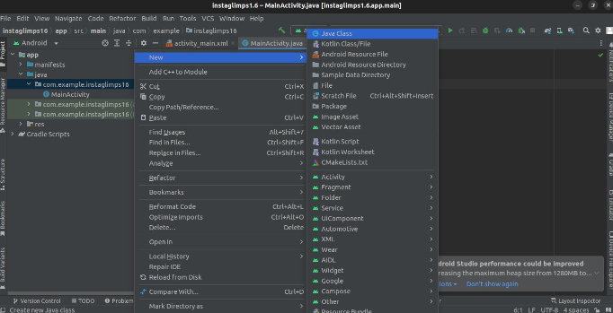
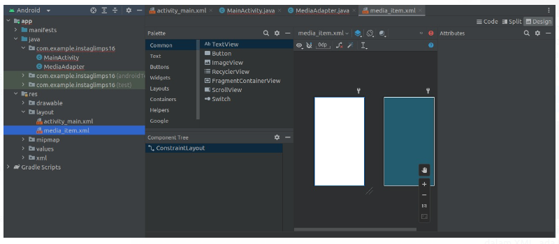

com.android.namaprojectnya 

adalah sebuah paket yang di import dalam kelas java apabila ada ketidaksesuain maka akan memerah semua kodenya terutama untuk modul R yang dipanggil. 

penambahan kelas baru. Umumnya satu kelas akan berada pada satu file untuk membuat file baru maka klik kanan pada hierarki folder dan pilih untuk membuat kelas java

Memiliki konsep modular yang kuat, sehingga jika di modul lain adalah kesalahan maka akan merah semua yang terkait dengan modul tersebut. 

- Folder manifest itu adalah kumpulan kode untuk memperoleh izin android dalam file XML

- res (resource) berguna untuk menampung file (XML) yang mengatur layout. Terdapat tiga mode yaitu mengedit secara koding, megedit secara drag and drop, dan gabungan. bisa dipilih pada bilah pojok kanan atas

> XML
        `android:id="@+id/viewPager"` ini adalah id `viewPager` yang digunakan untuk memanggil dari pemograman java, sering dipanggil di kelas mainactivity.java
		
> Apabila misa text="@string/desktripsi" ini adalah variabel yang file string.xml di folder value (res/value/string) disitu anda bisa mengatur nilai variabel

Sspek laptop lemot, tidak usah menjalankan emulator emulatoran, langsung build apk saja kemudian distribusikan ke hpmu untuk testing. 

aplikasi outputnya ada di /home/anamsigit/programfiles/instaglimps16/app/build/outputs/apk

saya sudah membangun aplikasi bernama instaglimps, adalah aplikasi untuk menampilkan konten instagram yang kamu simpan dalam bookmark. file tersebut didownload terlebih dahulu dengan python, kemudian akan ditampilkan mirip seperti tiktok biasa dikenal dengan swipable dari file yang telah didownload. dalam kasus ini saya belum bisa membuat sumber media dinamis

Dinamis yang dimaksud adalah saya bisa mengganti foto/video secara langsung dengan menelusuri folder mobile, tetapi media masih menjadi satu dengan .apk ini seperti file .zip. 

tetapi ini sudah cukup sepertinya, dengan fitur shuffle juga. aplikasi akan membaca foto dan video dengan nama spesifik agar dapat diimport ke aplikasi. kemudian sebenarnya kurang smooth transisisnya untuk video, saya mau resolve tapi chatGPT sudah tidak bisa mambantu dengan pengetahuan saya saat ini. sudah terlalu banyak yang perlu diubah menurutku. 

versi stable: instaglimps1.6
versi beta: instaglimps1.7