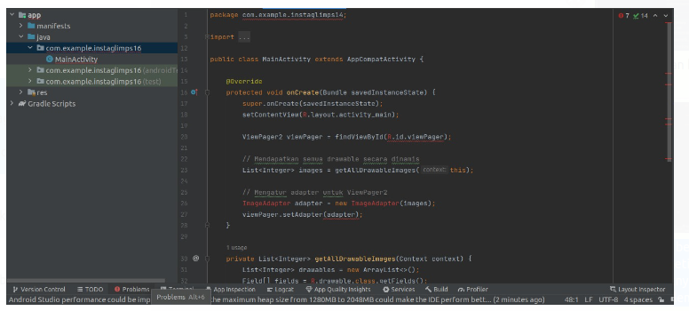

Tanda merah benar adanya error. dalam kasus ini disebabkan ketidak sesuaian package yang diimport yaitu nama projectnya tidak sesuai. bisa ditelusur dengan problem dibawah tab itu yang bewarna merah. 

dalam tab tersebut ada error untuk current file dan project error. jangan ditrabas kalau ada error tidak akan bisa dibuild. 

deteksi kesalahan sintaks itu modular, dan anda perlu mengunjugi satu satu dulu untuk merefresh apakah masalah sudah teratasi antar modul (baru terefresh ketika dipencet)