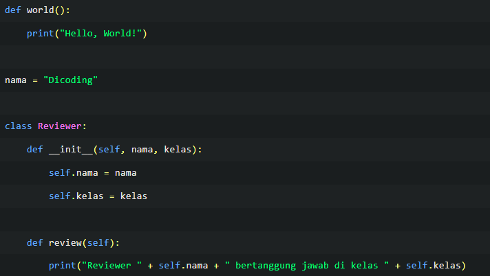
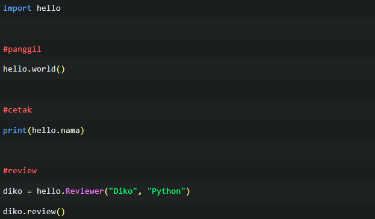

# Fungsi

fungsi membuat kode dapat digunakan berulang (reusability). sebaiknya fungsi hanya memiliki satu kegunaan spesifik namun dapat digunakan kembali. Fungsi-fungsi umum telah disediakan oleh Python misalnya print(). Namun Anda dapat selalu mendefinisikan fungsi Anda sendiri.

## return
pernyataan return [expression] akan membuat eksekusi program keluar dari fungsi saat itu, sekaligus mengembalikan nilai tertentu, contoh

	def kali(angka1, angka2):
		hasil = angka1 * angka2
		return hasil
		
dan bisa disimpan dalam variable

	def kuadrat(x):
		return x*x
	a = 10
	k = kuadrat(a)
	
>parameter adalah definisi masukan yang diterima fungsi, dan argumen adalah hal yang Anda masukkan saat memanggil fungsi tersebut.

## argumen
#### keyword argumen
Keyword argument adalah cara untuk menyediakan argumen dalam pemanggilan fungsi dengan menyertakan nama parameter dan nilainya. sehingga dapat menentukan nilai yang sesuai dengan parameter tertentu secara eksplisit, tanpa harus memperhatikan urutan parameter.

keyword argumen memasukkan argumen, dengan argumen itu berbentuk dictionary maka perlu menambahkan prefix * ganda (**) 

misalnya ada fungsi 'daftar'

	daftar(**{'tanggal': 1, 'bulan': 'Januari', 'tahun': 2020})

jika tidak dalam bentuk dictionary

	daftar(*(1, 'Januari', 2020))
	
contoh untuk memasukkan dictionary pada sebuah fungsi

	def fungsi_example(a, b, **kwargs):
    	print(a)
    	print(b)
    	print("kwargs =", kwargs)

	# memanggil fungsi dengan keyword argument
	fungsi_example(1, 2, c=3, d=4, e=5)
	
	# output:
	
	1
	2
	kwargs = {'c': 3, 'd': 4, 'e': 5}
	
#### positional argumen
digunakan untuk mengirimkan positional argument dalam bentuk tuple ke dalam sebuah fungsi, maka dapat mengirimkan positional argument dalam bentuk tuple, contoh 

	def fungsi_example(a, b, *args):
    	print(a)
    	print(b)
    	print("args =", args)

	# memanggil fungsi dengan positional argument
	fungsi_example(1, 2, 3, 4, 5)
	
	# ouput:
	
	1
	2
	args = (3, 4, 5)
	
	
## fungsi anonim
Fungsi Anonim (anonymous) tidak dideklarasikan seperti halnya fungsi pada umumnya dengan kata kunci def, melainkan menggunakan kata kunci (keyword) lambda

	kali = lambda nilai1, nilai2: nilai1 * nilai2
	print ("Hasil : ", kali( 11, 21 ))
	print ("Hasil : ", kali( 2, 2 ))

	# output:
	
	Hasil : 231
	Hasil : 4
	
# Modul
Menuliskan modul dapat dimulai dengan menuliskan definisi fungsi, kelas, dan variabel yang dapat digunakan kembali pada program lainnya. 

	def world():
    	print("Hello, World!")

jika hello.py dijalankan maka program tidak akan menjalankan apapun karena world() hanya berupa fungsi

Pastikan hello.py dan main.py berada dalam satu direktori agar dapat diimpor dan dipanggil.

	import hello
	hello.world()
	
	# output: Hello, World
	
## menambah variable

misalnya dalam hello.py tadi ditambah kode

	nama = 'dicoding'

maka di main.py dapat dipanggil dengan 

	hello.nama
	# output: dicoding
	
## menambah kelas

output:
Hello, World!
Dicoding
Reviewer Diko bertanggung jawab di kelas Python

apabila dalam hello.py langsung dipanggil disitu, misal dengan world() maka ketika hello di import dan dijalanka akan langsung menjalankan perintah world() dari modul import

## path folder
cara temporer untuk mengambil modul

	import sys
	sys.path.append('/home/dicoding')
	import hello
	
jika anda melakukan 

	print(sys.path)
 
 anda akan ditunjukkan posisi folder kerja anda, jadi ketika anda memindahkan modul anda disitu, maka akan bisa langsung terpanggil. 