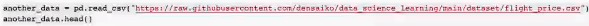
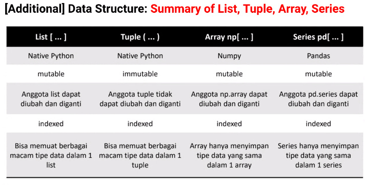

introduction to python, git adn github
untuk membuka csv, menggunakan numpy atau pandas with ari listyo wibowo (densaiko) dari teknik nuklir UGM gess. sebaiknya menggunakan github untuk menyimpan csv data dan dipanggil dari colab

my-var is not valid for python variable
