Git is a VCS created in 2005 by Linus Torvalds. The developer who started the Linux kernel. Git adalah opensource. kolaborator dapat berbagi dan menarik perubahan yang telah dibuat orang lain. 

You can use Git on a single machine without even having a network connection. Git clients can communicate with Git servers over the network using HTTP, SSH or Git's own special protocol

install git [*](https://git-scm.com/book/en/v2/Getting-Started-Installing-Git)

**git commit** : menyimpan perubahan pada file atau direktori ke dalam repositori Git
Commit pada Git biasanya terdiri dari informasi metadata, seperti pesan commit dan penanda waktu, serta perubahan pada fil. dibawah adalah ilustrasinya dimana itu tidak bisa diubah ya (seperti foto)

**git clone** : membuat salinan dari repositori Git yang sudah ada di server, ke dalam komputer lokal kita

**git init** : untuk membuat direktori kerja git, kurang lebih seperti ini
Ketikkan perintah git init. Ini akan membuat direktori .git baru di dalam direktori kerja Anda. Direktori .git ini akan berisi semua informasi yang diperlukan oleh Git untuk melacak perubahan pada proyek Anda.

Selanjutnya, Anda dapat menambahkan file ke repositori Anda dengan menggunakan perintah git add dan melakukan commit pada perubahan dengan menggunakan perintah git commit.

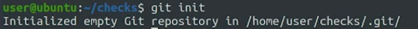

kita tidak menyentuhnya kecuali lewat git. Ketika kita mengedit file secara langsung di direktori Git tanpa melalui perintah Git, perubahan tersebut tidak akan terdeteksi oleh Git secara otomatis.

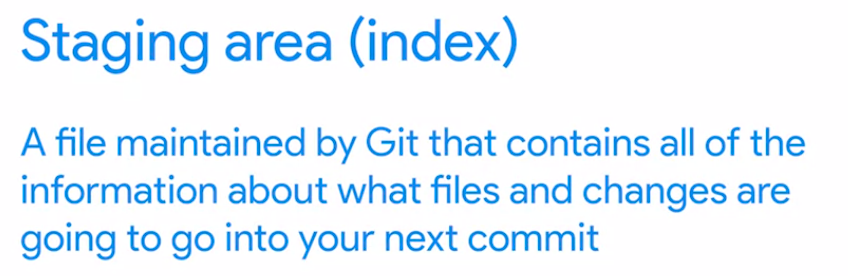

git status
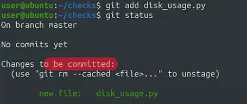

dibawah ini melacak perubahan
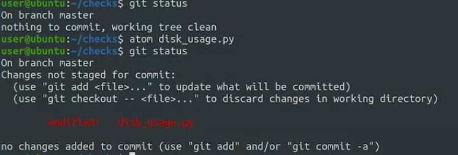
dapat dilihat git status pertama tidak mendektesi perubahan, setelah dirubah (lewat atom) dan dipanggil lagi git status itu menunjukkan perubahan. 

dan kita tambahkan 'add'
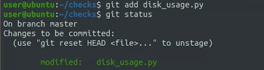

git commit -m 'add a senternce'
memberikan deskripsi singkat tentang perubahan yang dilakukan pada file atau direktori yang di-commit (add a sentence)

## Git config
mengonfigurasi preferensi pengguna Git pada komputer lokal. Perintah ini dapat digunakan untuk mengatur nama pengguna dan alamat email, editor default yang digunakan oleh Git, serta preferensi lainnya yang dapat disesuaikan.

Beberapa contoh penggunaan git config:

Mengonfigurasi nama pengguna: git config --global user.name "Nama Anda"
Mengonfigurasi alamat email: git config --global user.email "email@domain.com"
Mengonfigurasi editor default: git config --global core.editor "nama editor"

ini sangat penting karena sering digunakan untuk menandai pengguna yang melakukan commit pada perubahan tertentu pada repositori. 

sedangakan git config -l adalah perintah dalam Git yang digunakan untuk menampilkan daftar semua konfigurasi Git yang telah diatur pada komputer lokal. seperti dibawah ini 

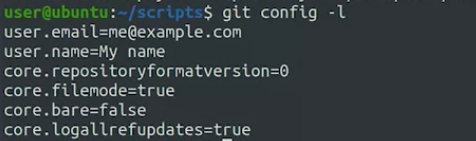

# simple workflow git 
membuat git init (untuk membuat repositori git)
membuat file didalamnya
menambahkan file tersebut dengan git add
kemudian git commit, git commit harus disertai dengan komentar atau tidak itu tidak akan dijalankan
kemudian kita bisa memantau dengan git status

saran isi dari komen commit, sebaiknya kurang lebih 75 karakter
This is followed by a full description of the changes which details why they're necessary and anything that might be especially interesting about them or difficult to understand. When you run the git commit command, Git will open up a text editor of your choice so you can write your commit message

 command  we use to review the commit history for our project is ***git log***
 
 gunakan git log untuk mengetahui semua commit
 
 ****
Branch digunakan untuk experimental
When we covered the basic Git workflow, we called out that the process is usually to make changes, stage them, and then commit them. 

## "git commit -a" 
melakukan commit terhadap perubahan yang sudah dilakukan pada semua file yang terlacak (tracked) di dalam repository Git.
jadi tidak perlu satu satu, tetapi tetap anda harus memberikan catatan commit sebagai syarat commit

	git commit -a -m 'saya rubah semua'

	try:
    	subprocess.check_call(["git", "push"])
		except subprocess.CalledProcessError as e:
    		sys.exit("Gagal melakukan push: " + str(e))
			
diatas, sys.exit() digunakan untuk menghentikan skrip dan menampilkan pesan kesalahan jika terjadi kesalahan dalam proses Git (baik saat melakukan pull atau push).

***
## mengetahui lebih tentang perubahan
gunakan git log -p
menampilkan riwayat commit (commit history) dari sebuah repository Git, beserta perubahan (diff) yang terjadi pada setiap commit.

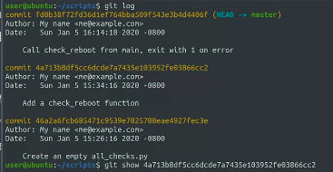

git log hanya menampilkan riwayat commit, anda juga bisa menujukk commit tersebut dengan git show 'ID commit'

bisa juga tanpa memberikan ID commit

git log -stat, menampilkan statistik apa saja yang banyak dirubah
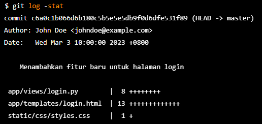

git diff untuk menampilkan perbedan, Sedangkan git diff --staged atau git diff --cached adalah perintah Git yang digunakan untuk menampilkan perbedaan antara commit terakhir dan index (staging area) saat ini.

****
## Deleting and remaning file
menghapus file
git rm
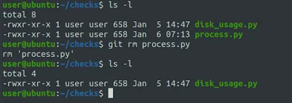

kemudian anda bisa melacaknya dengan git status

	git mv

untuk memindah

### git ignore
.gitignore adalah file konfigurasi di dalam repository Git yang digunakan untuk menyatakan file atau direktori mana yang harus diabaikan (ignored) oleh Git.

contoh 

diatas adalah semua karakter (*) untuk ekstensi tertentu, dengan kata lain adalah pattern

disimpan di dalam direktori root (akar) dari repository Git. Ketika ada file atau direktori yang sesuai dengan pola yang ada di dalam file .gitignore, Git akan mengabaikan file atau direktori tersebut dan tidak akan memasukkannya dalam repository Git.

****
## Summary
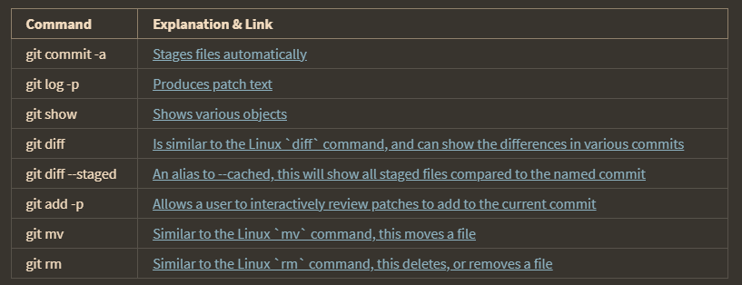

# UNDOING
git checkout
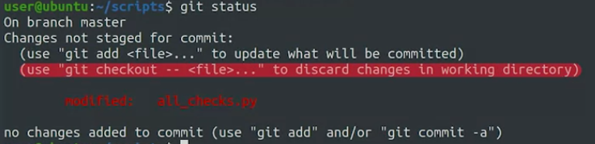

so the purpose of the git checkout command is **It reverts changes to modified files before they are staged.** jadi setelah di commit itu sudah seperti hasil foto.

seperti ini jika menggunakan git reset

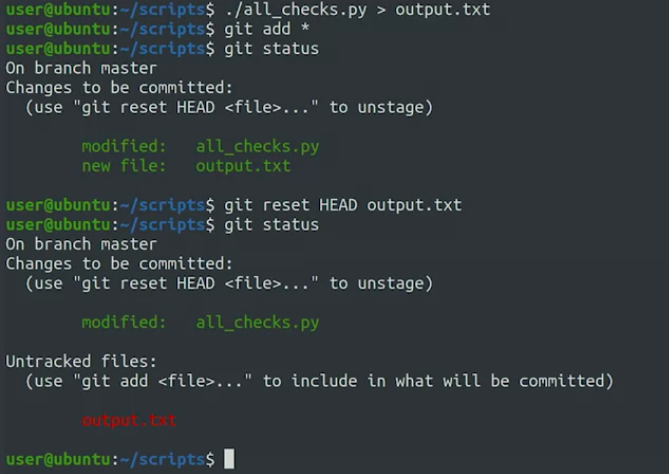

git reset -p adalah sebuah perintah pada Git yang memungkinkan pengguna untuk melakukan reset pada bagian-bagian tertentu dari sebuah commit

## amending commit
Perintah git commit --amend digunakan untuk melakukan amending commit pada Git. Git akan membuka editor teks default yang telah dikonfigurasi pada komputer dan memungkinkan pengguna untuk mengedit pesan commit atau memilih file-file yang ingin dimasukkan ke dalam commit baru tersebut. atau dengan kata lain Overwrite the previous commit. 

misalnya 
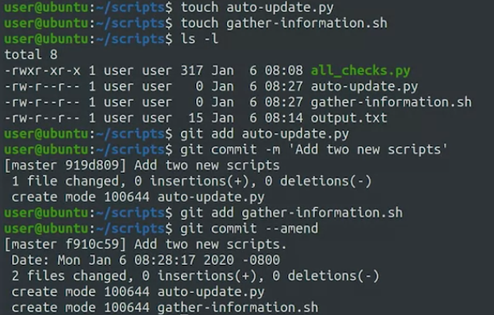

kita membuat dua file, tetapi kita baru menambahkan 'add' pada satu file saja, dan setelah itu sudah commit, padahal file satunya lagi tadi belum di commit. maka dari itu kita akan overwrite commit itu. dengan menambahkan file yang belum di 'add' baru itu git commit --amend

 ## Rollback
Fixing your work before you commit is good. But what happens if it's already been snapshotted by Git? Let's say you host to Git repository on a company server that contains all kinds of useful automation scripts that you and your coworkers use.

### git commit HEAD
Perintah git revert HEAD mengacu pada commit terakhir pada riwayat commit, yaitu HEAD. git revert HEAD adalah sebuah perintah pada Git yang digunakan untuk membuat sebuah commit baru yang membatalkan perubahan pada commit terakhir pada riwayat commit.

Perintah git revert sangat berguna ketika kita ingin membatalkan perubahan pada commit tertentu tanpa menghapus riwayat commit sebelumnya. Ini memungkinkan kita untuk mengembalikan kode ke keadaan sebelum commit tersebut

> git revert digunakan untuk membuat sebuah commit baru yang secara terbalik membatalkan perubahan dari commit sebelumnya. Dengan kata lain, git revert tidak menghapus perubahan pada commit sebelumnya, tetapi membuat commit baru yang membatalkannya. Sedangkan git reset digunakan untuk menghapus perubahan pada commit sebelumnya dan mengembalikan repositori ke kondisi yang diinginkan.

****
## Identifying commit
setiap commit memiliki ID (berbentuk SHA1)

> SHA1 adalah bagian dari kriptokurensi

git menggunakan SHA1 untuk konsistensi saja. 

git log -1 adalah sebuah perintah pada Git yang digunakan untuk menampilkan satu buah commit terakhir pada riwayat commit. 

 