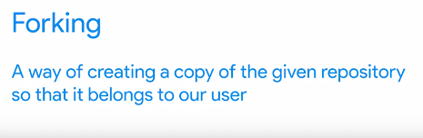

## Pull request

We've created a commit on our forked repo. But we haven't yet created the pull request that will send the changes to the owner of the original repo

Pull request adalah sebuah fitur yang tersedia di GitHub yang memungkinkan seorang pengguna (biasanya  kontributor) untuk mengajukan perubahan kode ke sebuah proyek open-source yang dihosting di GitHub. Prosesnya dimulai dengan melakukan fork (menyalin) repositori proyek ke akun GitHub milik kontributor, lalu membuat branch baru untuk membuat perubahan pada kode, kemudian mengajukan pull request untuk meminta pemilik proyek menggabungkan perubahan yang dibuat.

ini adalah bagaiman membuat file readme, membuat brach dan push to server
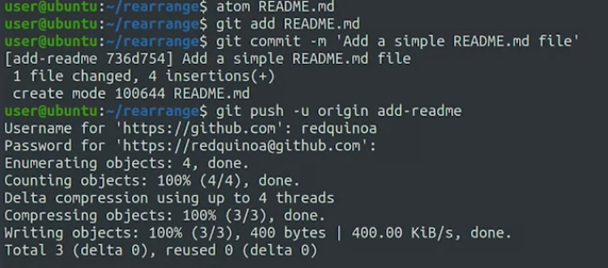

dan bisa dilihat di github
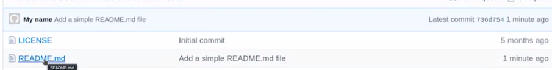

setelah itu bisa di pull request kepada si owner untuk dipertimbangkan. mungkin bisa terjadi percakapan sepertin ini
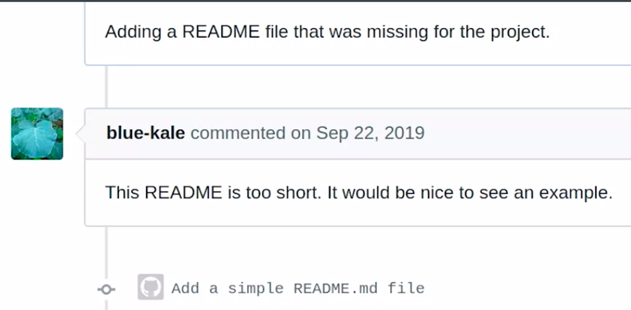

maka jika ingin mengubah, edit di lokal. kemudian git commit. kemudian git push. 

***
Git Rebase dapat digunakan untuk mengubah komentar pada commit sebelumnya. dilakukan dengan memanfaatkan opsi "-i" atau "--interactive"

	git rebase -i

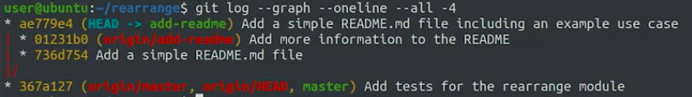

diatas adalah ada dua file yang berbeda jalur, ketika di push akan menimbulkan masalah, tetapi kita bisa memaksanya menjadi git push -f. but it will possibly resulting in permanent data loss

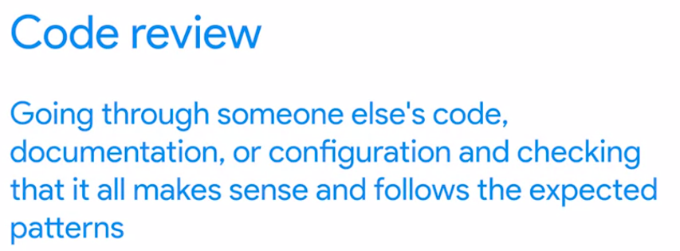

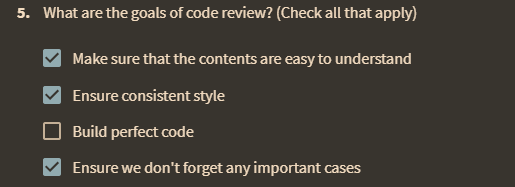

 On top of this, if the person contributing the changes of volunteer that's just trying to help, they may lose their motivation to work on the project if you make them wait too long for feedback. 
 
 You should also be careful with which patches you accept or reject
 
 ***
 A tool like an issue tracker or bug tracker can help us coordinate our work better. An issue tracker tells us the tasks that need to be done, the state they're in and who's working on them.
 
 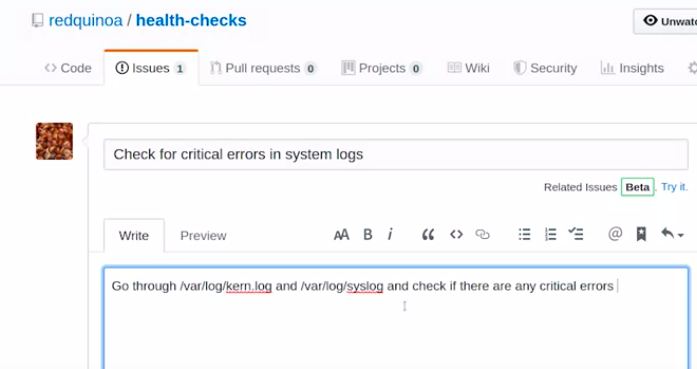
 
 >We can reference issues in our commits with automatic links by using one of the keywords followed by a hashtag (#) and the issue number

What is an artifact in terms of continuous integration/continuous delivery (CI/CD) pipelines?
answer : Any file generated as part of the CI/CD pipeline.

Continuous Integration system is similar with Run tests automatically

*** 

append a line: "Closes: #1" at the beginning to indicate that you're closing the issue. Adding this keyword has an additional effect when using Github to manage your repos, which will automatically close the issue for you (for more information, please see the documentation here).

ini fork repositoriesmu, kamu pull reques ke ownernya dengan mengajukan branch anda
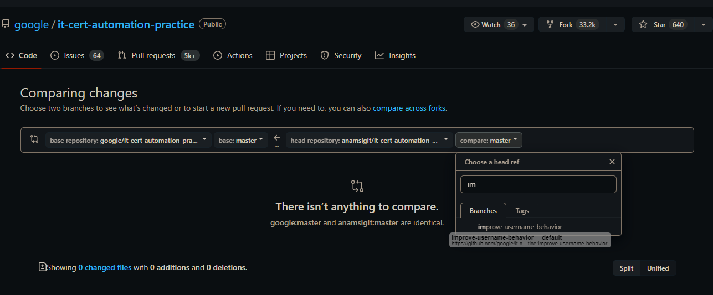

branchnya yaitu namanya improve-username-behavior

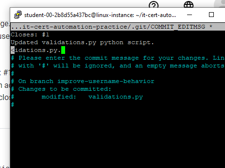

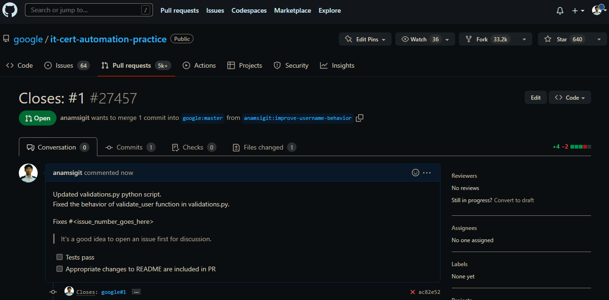