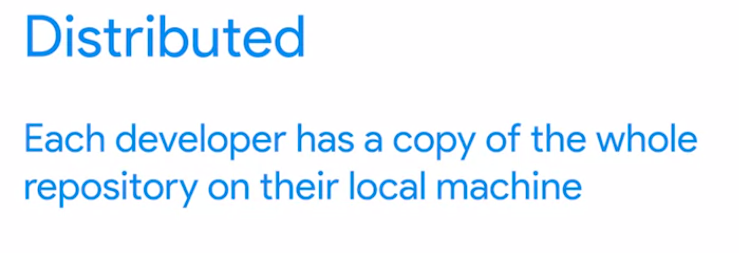

so.. the Github is A remote repository hosting service for Git

cloning github ke local
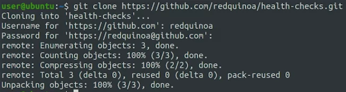

kemudian di local ita mengolah dengan git
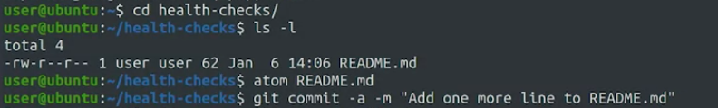

kemudia jika ingin mengunggah ke cloud (github) gunakan git push (guakan git clone untuk membawanya ke local)

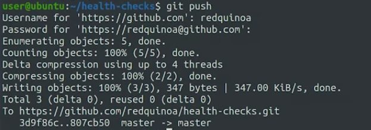

maka di github akan ada pemberitahuan. 

	git pull 

adalah perintah untuk mengambili perubahan baru dari repositori (local). 
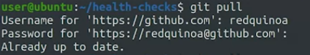

beberapa remote repositori terkenal 
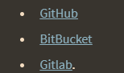

git config --global credential.helper cache allows us to configure the credential helper, which is used for **Allowing automated login to GitHub**

jika ada perubahan besar di repositori, git akan meminta konfirmasi anda terlebih dahulu.

****
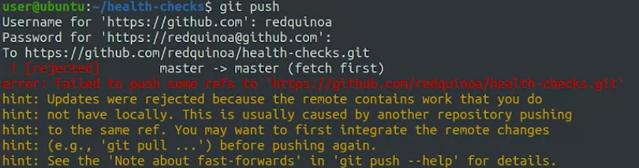

kesalahan karena :
Git rejected our change, that's because the remote repository contains changes that we don't have in our local branch that Git can't fast-forward.

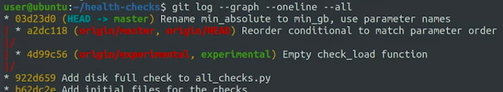

itu karena ada branch yang tidak menyambung, ditunjukkan oleh grafik. 

The graph indicates that our current commit and the commit in the origin/master branch share a common ancestor, but they don't follow one another.
	
itu artinya kita harus melakukan algoritma tida jalan seperti yang telah dijelaskan pada chapter sebelumnya

This means that we'll need to do a three-way merge. To do this, let's look at the actual changes in that commit by running git log -p origin/master.

dan disini letak tubrukanya

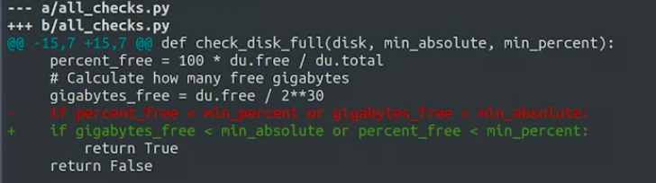

jika dibuka di text editor seperti ini
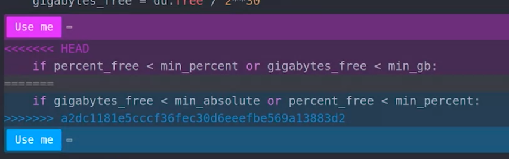

setelah itu seperti langkah-langkah selanjutnya yaitu

git add < nama file >
git commit 
git push (kita ulangai lagi untuk upload ge server)

dan hasilnya seperti ini
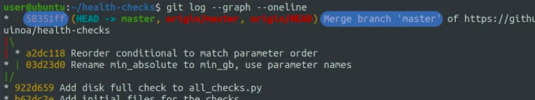

****
gunakan git checkout -b namabranch atau git checkout -brach namabranch 

untuk menuju ke direktori kerja branch

upload branch lokal ke branch server dengan 

	git push -u 
	
misalnya ini push brach refactoru dari lokal se server

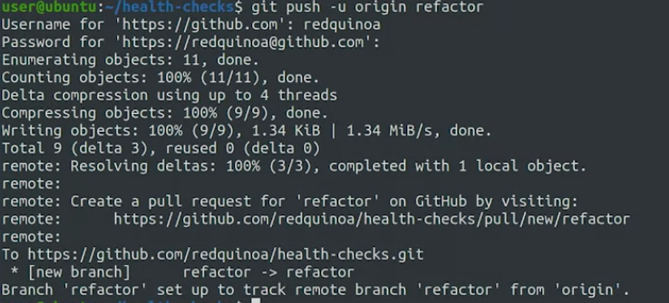

The command "git rebase refactor" will move the current branch on top of the refactor branch.

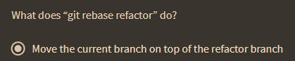

perbedaan utama antara git rebase dan git merge adalah bagaimana Git menggabungkan perubahan dari branch sumber ke branch target dan bagaimana hal itu mempengaruhi sejarah commit. Git merge membuat commit merge baru, sementara Git rebase memindahkan commit dari satu branch ke branch target dan mengubah sejarah commit pada branch sumber.

seperti ini rebase workflownya

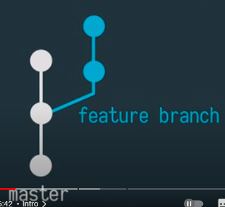
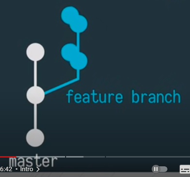
kemudian menjadi seperti ini
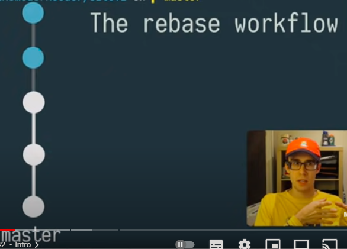

karena
menjaga sejarah tetap linier membantu debugging terutama ketika kami mencoba mengidentifikasi commit mana yang pertama kali menimbulkan masalah dalam proyek kami. 

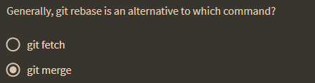

***

It's better if you split it into different commit. This makes it easier to understand what's going on with each commit.

****

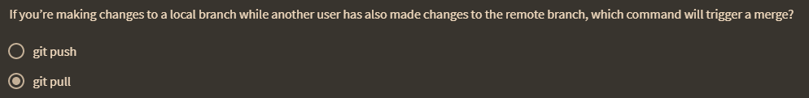

To change the base of the current branch, we can use the git rebase < branchname > command. In contrast, the git checkout < branchname > command is used to switch to a different branch

****

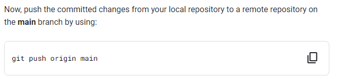

jika anda sudah maka digithub ada id yang mempush nya
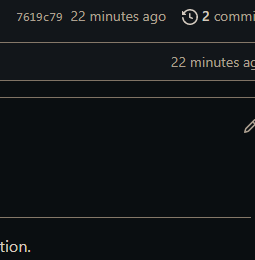
pojok kiri atas	

alurnya kek gini
masuk ke git

buat token (atau kalao dulu pake username dan password) tetapi sekarang password diganti dengan token yang digenerate dari github untuk masalah keamanan. 

git add
git commit -m 'tambahkan catatan'

***ketika di githun ditambahkan suatu file diaman di lokal tidak ada, maka itu akan error. harusnya kondisi di github dan di lokal adalah sama ketika anda memberikan kode***

	git push origin main

maka kita perlu tarik dulu yang dari server ke local

	git pull origin main

kemudian baru kita push lagi

	git push origin main

