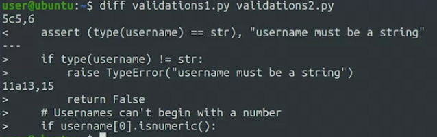
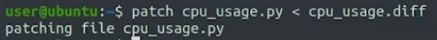
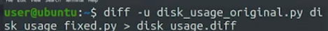
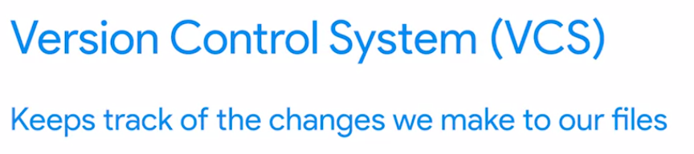

membandingkan dua file

## diff tool
The diff tool is a software utility used to compare and display the differences between two files. It can be used to compare source code files, configuration files, text documents, or any other type of file. By comparing the content of two files, the diff tool can highlight the lines or sections that are different and show the specific changes that were made, such as adding, deleting, or modifying lines. The diff tool is commonly used by software developers to track changes to source code files and collaborate on code changes.

mungkin bisa dituliskan sebagai berikut agar aplicable

## patch
patch dalam bahasa indonesia dinamaka dengan tambalan
Patch adalah sebuah file yang berisi perubahan kode atau data yang dibuat oleh pengembang atau kontributor. File patch biasanya dibuat menggunakan perangkat lunak diff, yang membandingkan dua file dan menunjukkan perbedaan antara keduanya.

File patch berisi perubahan dalam bentuk perbedaan antara versi asli (biasanya disebut sebagai "basis" atau "sumber") dan versi modifikasi dari file atau kode.

Saat diterapkan pada file asli menggunakan perangkat lunak diff, file patch dapat membuat file asli berubah sesuai dengan modifikasi yang dijelaskan di dalam patch. seperti dibawah ini

in other words, it is mean applies the changes contained in a diff file to another file.

The patch command can detect that there were changes made to the file and will do its best to apply the diff anyways. contoh penerapanya

misalnya dalam studi kasus
Kami telah menyiapkan file diff dengan perubahan yang perlu diterapkan pada skrip. Apa yang perlu dilakukan rekan kita sekarang? 
jawab: Run patch disk_usage.py < disk_usage.diff.

misalnya studi kasus bug kau ingin membantu temanmu. file temanmu adalah rizacode.py. maka kau mengkopi file tersebut dan menamainya dengan rizacode_fix_bySigit.py. maka jika ingin mengaplikasikan pembenaran gunakan diff : 

diff rizacode.py rizacode_fix_bySigit.py > rizacode.patch

maka kirimkan rizacode.patch ke riza untuk membenarkan kode	

**diff -u** is used to compare two files, line by line, and have the differing lines compared side-by-side in the same output. 

**diff** is used to find differences between two files

**Patch** is useful for applying file differences

****
## Version control

salah satu contoh VCS adalah git

dengan VCS we can know when the changes were made and who made them. VCS ini dapat memberikan keterangan history perubahan dan kenapa terjadi perubahan. atau memutar kembali ketika mendapati masalah saat itu	

### commit
kita dapat mengedit banyak file dan memperlakukan kumpulan suntingan itu sebagai satu perubahan yang umumnya dikenal sebagai commit.

itu mencegah anda menghadapi sepotong kode yang ditulis orang lain 3 bulan lalu dan anda bingung cara kerjanya
