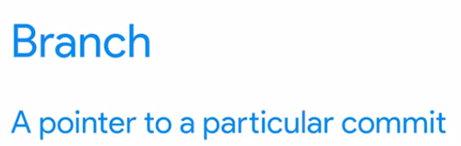
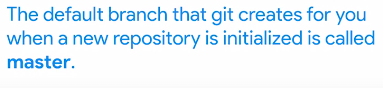

What is the purpose of organizing repositories into branches?
is to enable changes to be worked on without disrupting the most current working state.

master itu adalah kerja utama, sedangkan branch adalah untuk bereksperimen

> We can use the git branch command to list, create, delete, and manipulate branches.

seperti ini
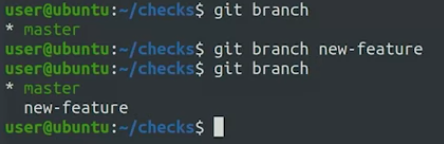
itu menambahakan brach bernama new-feature	

gunakan 

	git checkout new-feature

untuk berpindah direktori kerja ke branch new-feature. 
jika ingin membuat dan langsung masuk dalam direktori tersebut gunakan

	git checkout -b new-feature_v2
	
bisa diketahui kita di brach atau dimaster dengan git status
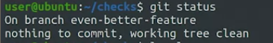
jika ingin ke master, git checkout master

gunakan git brach -d < nama branch > untuk menghapus

******
## Marging
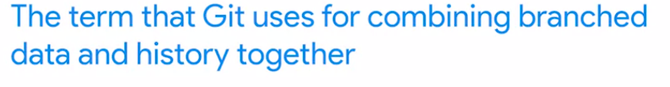

ilustrasi marging
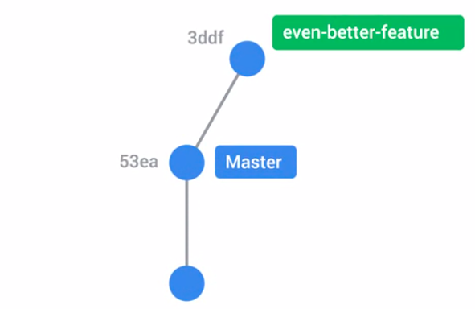
setelah di marging
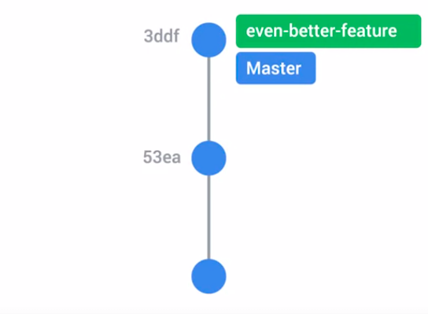

#### fast-forward and three-way merge
dua algoritma yang digunakan git dalam merge branch ke master

Fast-forward merge terjadi ketika branch yang sedang di-merge ke master memiliki riwayat commit yang linear dan tidak ada commit baru di branch master sejak branch tersebut dibuat. Dalam situasi ini, Git dapat menggabungkan branch dengan cara langsung memindahkan referensi HEAD branch utama ke referensi HEAD branch yang sedang di-merge. ilustrasinya digambarkan diatas

cara merge

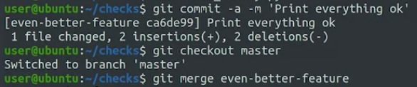

diatas dapat dilihat, pertama membuat file, add, dan commit (ke brach) kemudian pindah ke master dengan checkout master. setelah di master kita bisa merge brach yang dimaksud

### Git conflict
sedamgangkan three way merge  Git harus menggabungkan dua branch yang memiliki commit yang berbeda di bagian yang sama dari file. Git akan mencoba untuk menggabungkan perubahan dari kedua branch secara otomatis, tetapi jika ada konflik Git akan meminta pengguna untuk memperbaikinya secara manual. Setelah konflik diatasi, Git akan membuat commit baru yang mewakili hasil penggabungan tersebut.

seperti diatas adalah konflik, dimana dalam 1 file ada dua pengedit berbeda yang tidak bisa di merge, maka itu diserahkan ke developer untuk mewakiliki dari kedua perubahan tersebut. 

bisa dicek dengan git status
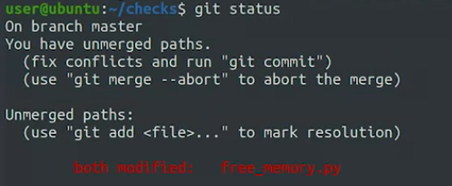

untuk itu kita bisa membuka text editor yang disetel default olehnya
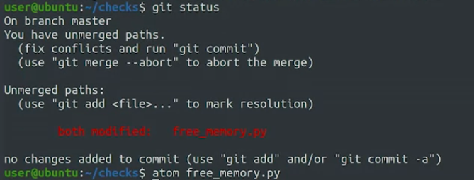

dan hasilnya adalah seperi ini, ada mark yang menandakan ada perubahan disitu. jika sudah developer selesaikan, bisa langsung disimpan daja, dan kembali ke terminal tadi tambahakn file tadi 

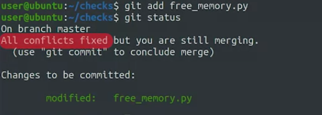

setelah itu git commit

git log --graph --online
melihat riwayat commit secara grafis dan membaca pesan commit dengan cepat dalam satu tampilan.

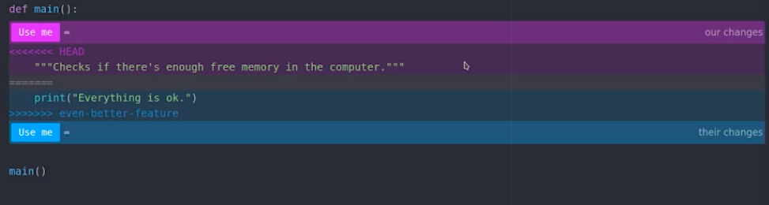

seperti ini yang ditampilkan

seperti ini contoh pembenaranya
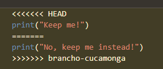
mennjadi 
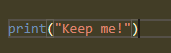

ilustrasi yang yang 3 way algorithm git
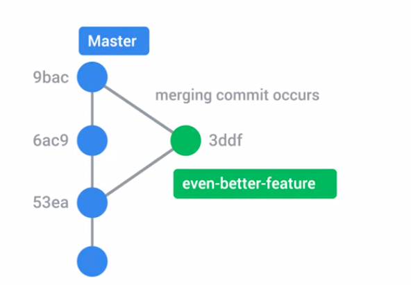

## summary
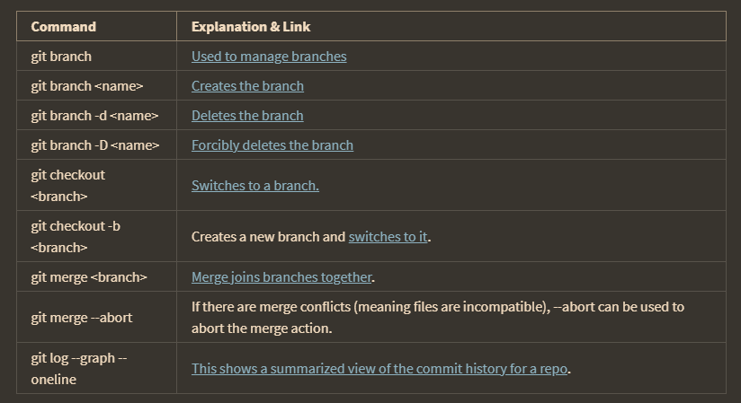

command would we use to throw away a merge, and start over is git --abort

ini saya di VM qwilabs
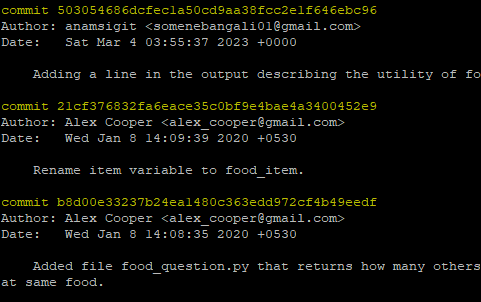

masuk ges, itu adalah hasil git log, karena tadi saya telah commit maka nama saya tercatat disitu, untuk keluar dari log, ketikkan q dan enter

ketika di revert itu, adalah ketika dimana kesalahan itu ditemukan
misalnya aziz mengkomit, dan di aziz ternyata ditemui kesalahm maka revertnya adalah ke aziz

git revert [ID COMMIT]
dimana ID COMMIT dapat dilihat di git log, silakan dicari dan mungkin pesan commit akan membantu
