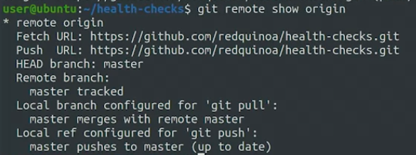
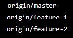
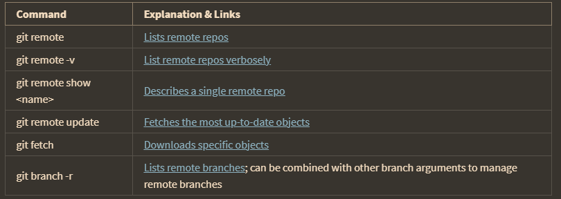

fetch adalah mengambil perubahan dari server ke local ke [tetapi tidak langsung di merge], sedangkan pull adalah mengambil perubahan dari local ke server. 

"origin" dapat merujuk pada label atau alias yang diberikan kepada repositori jarak jauh mana pun yang digunakan

git branch -r 

ini menunjukkan ada 2 branch dan 1 master

	git remote show origin

Git akan menampilkan informasi seperti URL repositori jarak jauh, cabang (branch) yang tersedia di repositori jarak jauh, dan apakah ada perbedaan antara cabang lokal dan cabang jarak jauh.

### Summary

