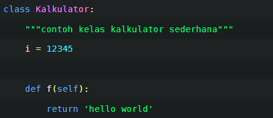
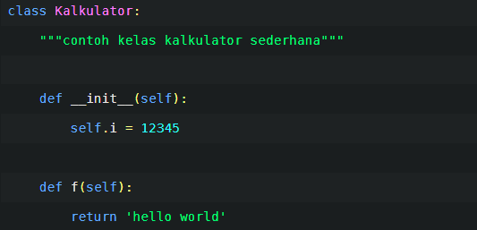
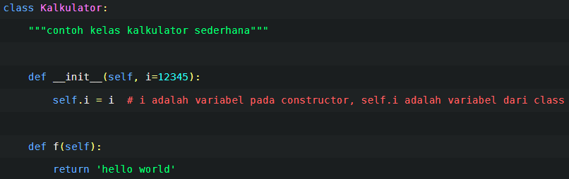
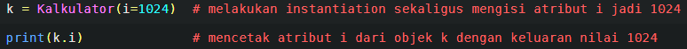
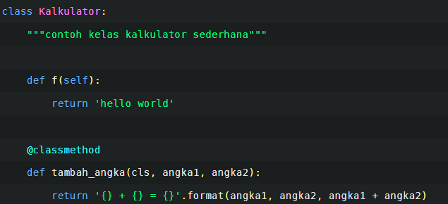

## Class
kelas atau class dalam bahasa inggris, sebenarnya dalam bahasa indonesia itu kurang merepresentasikan lebih tepatnya adalah blueprint

Class merupakan sintaksis di Python yang menyediakan semua fitur-fitur standar dari Pemrograman Berorientasi Objek

Definisi dari kelas seperti halnya definisi fungsi yang menggunakan sintaksis def, kemudian perlu dipanggil dahulu agar memiliki output

	class NamaKelas
		pass

sebuah kelas mendukung dua macam operasi: mengacu pada atribut dan pembuatan instance

Dari pembuatan class Kalkulator di atas, di dalamnya ada definisi atribut i dan definisi fungsi f.
Kalkulator.i mengembalikan nilai integer
Kalkulator.f mengembalikan fungsi

	Kalkulator.i = 1024  

maka nilai atribut i dalam Kalkulator berubah dari 12345 menjadi 1024

## Object
object adalah instance of a class. menggunakan notasi fungsi yaitu dengan kurung buka-kurung tutup (), akan menghasilkan sebuah objek. Kemudian hasil instantiation ini biasanya disimpan dalam sebuah variabel, misal

	k = kalkulator()

membuat instance dari kelas jadi objek, kemudian disimpan pada variabel k

method, adalah sebuah fungsi khusus yang menjadi "milik" suatu objek. maka untuk memanggil metode f dari objek k, hasil instance dari class Kalkulator di atas sebagai berikut.

	print(k.f())  
	# output: hello world
	
## Class’ Constructor

sering ditemui kebutuhan mengeset nilai awal atau kondisi awal dari atribut yang dimiliki oleh class tersebut, sehingga untuk kebutuhan ini digunakan sebuah fungsi khusus yang disebut pembangun (constructor).

metode sebagai constructor ini bernama __ init __ . Pada saat dilakukan instantiation dari class, metode __ init __ ini secara otomatis akan dipanggil terlebih dahulu.

beriktu adalah definisi class kalkulator tadi jika diubah dengan mengunakan constructor

Pada contoh berikut ini, constructor memiliki parameter i yang bersifat opsional, apabila dalam proses instantiation tidak dikirimkan parameter, secara otomatis i akan diisi nilai bawaan 12345

## metode (method)
3 jenis metode yaitu 1) metode dari object; 2) metode dari class dan; 4) dan metod secara static.

ecara umum metode adalah sebuah fungsi khusus yang menjadi “milik” suatu objek, yakni hasil instantiation dari class

Argumen pertama dari metode-metode dalam class, biasa diberikan nama self sebagai suatu konvensi atau standar penamaan, meskipun Anda bisa juga menggunakan nama lain

k adalah objek hasil instance dari class Kalkulator, saat melakukan pemanggilan metode f.

	k.f()

ekuivalensi dengan

	Kalkulator.f(k)

Argumen self pada metode f akan diisi dengan objek hasil instance dari class Kalkulator.

#### classmethod
Classmethod adalah sebuah fungsi yang mengubah metode menjadi metode dari class (class method). pemanggilannya bisa langsung dari class yang terdefinisi ataupun melalui objek.

## inheritence 
konsep pewarisan. Suatu kelas B dapat mewarisi kelas A, sehingga secara otomatis memiliki semua fitur yang dimiliki oleh kelas A (atribut danmetode).  kelas A disebut sebagai kelas dasar, yakni kelas yang memberikan warisan dan kelas B adalah kelas turunan

>Jika di kelas B memiliki metode dengan nama yang sama dengan yang dimiliki kelas A, maka metode tersebut akan menimpa metode yang diwariskan dari kelas A.

jika sebelumnya pernah belajar bahasa pemrograman yang memiliki variabel privat, dimana variabel tersebut tidak dapat diakses kecuali dari objek yang bersangkutan, di Python hal tersebut tidak ada.

> penggunaan nama yang diawali dengan garis bawah (underscore), baik itu fungsi, metode, maupun anggota data, akan dianggap sebagai non-publik.
