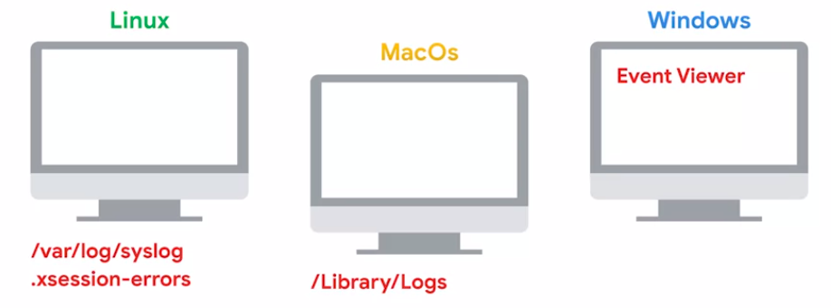
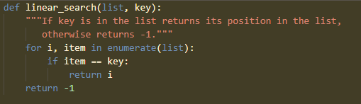
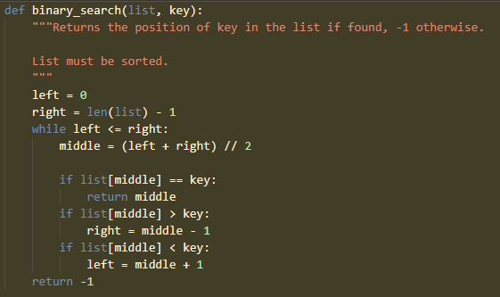
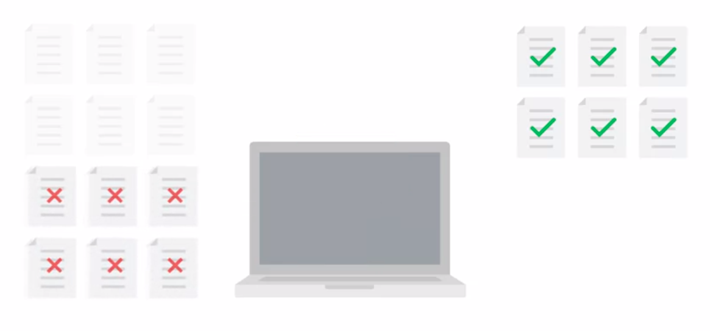
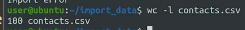
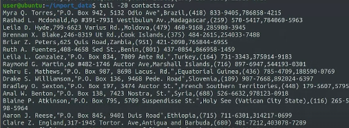
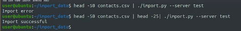
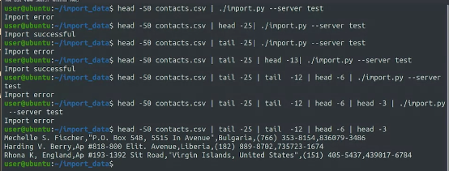

Reproducrion case

log kesalahan disimpan

if you're unlucky, and there's no error message, or the error message is super unhelpful like internal system error. The next step is to try to isolate the conditions that trigger the issue

## strace
memantau aktivitas sistem panggilan (system calls) yang dilakukan oleh sebuah program, seperti membuka dan menutup file, mengalokasikan memori, dan melakukan operasi I/O. ini dapat digunakan untuk menganalisis komunikasi program dengan sistem operasi. 

## ltrace
memantau aktivitas pemanggilan fungsi (function calls) yang dilakukan oleh program. Ini termasuk pemanggilan fungsi dari pustaka dinamis yang digunakan oleh program. misalnya libc atau lainya. ini dapat membantu menganalisis ketika program kesulitan memanggil pustaka yang diperlukan. 

*****
## understanding the problem

long-term remediation adalah mencegah terulangnya masalah di masa depan, bukan hanya menangani gejala atau masalah secara sementara.

it's always a good idea to check if we can reproduce the problem in a test environment before we modify production

### iotop
a tool similar to top that lets us see which processes are using the most input and output. contoh lainya adalah iostat and vmstat. 

### iftop
another tool similar to top that shows the current traffic on the network interfaces. 

Trickle to limit the bandwidth being used

****
bugs that come and go are hard to reproduce, and are extremely annoying to debug. so you should understand when the issue happens and when it doesn't.

Many applications and services already include a debugging mode that generates a lot more output then the default mode.

For bugs that occur at random times, we need to repair our system to give us as much information as possible when the bug happens. This might require several iterations until we get enough information to understand the issue.

ketika kita merestart komputer, kebanyakan masalah akan selesai, it is okay. because  it will going back to a clean slate means releasing all allocated memory, deleting temporary files, resetting the running state of programs, re-establishing network connections, closing open files and more. jika ada aplikasi seperti itu, kemungkinan aplikasi tersebut terdapat bug kemungkinan besar adalah tidak bisa mengelola sumber daya dengan baik. 

***

## Linear search
linear search adalah mencari satu satu dari atas permasalaan yang mungkin terjai tetapi the time it takes to find the result is proportional to the length of the list. If the list is sorted, we can use an alternative algorithm for searching called binary search.

## Binary search 
Because the list is sorted, we can make decisions about the position of the elements in the list. So the first thing we do is compare the name that we're looking for with the element in the middle of the list and check if it's equal, smaller, or bigger.

jika lebih kecil, seharusnya itu akan berada diatas, dan sebaliknya jika lebih besar. cara itu kita ulang-ulang sampai menemukan elemen yang dimaksud. 

Using linear search, going through a list with 1000 elements might take up to 1,000 comparisons if the element we're looking for is the last one in the list or isn't present at all.
 
binary search dapat digunakan untuk mencari lokasi kesalahan atau bug dalam kode. Dengan cara membagi kode ke dalam bagian-bagian yang lebih kecil, kita dapat mempersempit area di mana kesalahan terjadi, dan dengan menggunakan binary search, kita dapat mencari area yang berpotensi mengandung kesalahan dengan lebih cepat dan efisien.

tetapi algoritma tersebut membutuhkan pengurutan. 

binary search dan linear search code look like

he problem is cut in half. This approach is sometimes called bisecting which means dividing in two

ini adalah dengan mengkopi setengah direktori dan mengeceknya disana

dan setengah lagi sampai didapatkan sekecil mungkin

 if the latest release of the Linux kernel causes the sound card on your computer to stop working, you can use Git bisect to find the commit that broke it and report this as a bug to be fixed
 
 ***
 mengetahui jumlah line dalam file
 
 
 atau gunakan head untuk print paling atas atau tail untuk print paling bawah. 
 
 
 
 dibawah ini adalah penerapan dari pembagian tadi, yaitu dibagi2 setengah
 
 
 
 ini bisa untuk mencari data yang invalid, dan seperti ini
 
 
 

 
