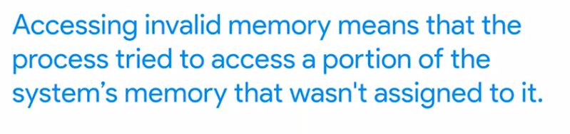

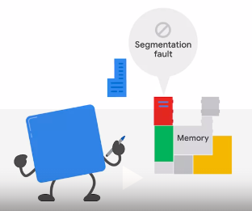

When this happens, the OS will raise an error like segmentation fault or general protection fault. What kind of programming error is this? It typically happens with low-level languages like C or C++ where the programmer needs to take care of requesting the memory that the program is going to use and then giving that memory back once it's not needed anymore

Common programming errors that lead to segmentation faults or segfaults include forgetting to initialize a variable, trying to access a list element outside of the valid range, trying to use a portion of memory after having given it back, and trying to write more data than the requested portion of memory can hold

One of the trickiest things about this invalid memory business is that we're usually dealing with undefined behavior. This means that the code is doing something that's not valid in the programming language.

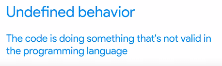

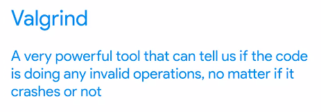

Valgrind is available on Linux and Mac OS, and Dr. Memory is a similar tool that can be used on both Windows and Linux	

***
Correctly handling memory is a hard problem, and that's why there's a bunch of different programming languages like Python, Java, or Ruby that do it for us. But that doesn't mean programs written in these languages can't trigger weird problems.

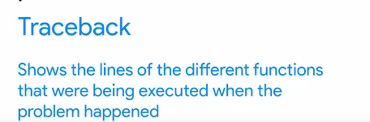

For a Python, program we can use the **BDB interactive debugger** which lets us do all the typical debugging actions like executing lines of code one-by-one or looking at how the variables change values. When we're trying to understand what's up with a misbehaving function on top of using debuggers, it's common practice to add statements that print data related to the codes execution.

 how do you even start reading through someone else's code? This depends a bit on personal preference and the size of the project. If there are only a couple of 100 lines of code, it's feasible to read all of them. But when the project has thousands or tens of thousands of lines of code, you can't really read the whole thing. You'll need to focus on the functions or modules that are part of the problem that you're trying to fix
 
 ***
 a simple example program that crashes with a seg fault.
 
 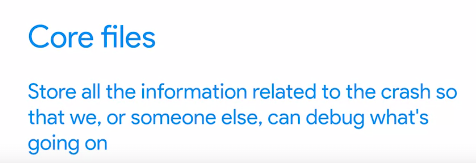
 
 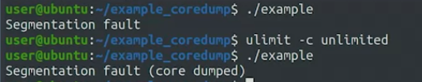
 
 GDB shows a bunch of messages including its version, license, and how to get help. It then tells us that the program finished with a segmentation fault. It shows that the crash happened inside the strlen function in a file that's part of the system libraries
 
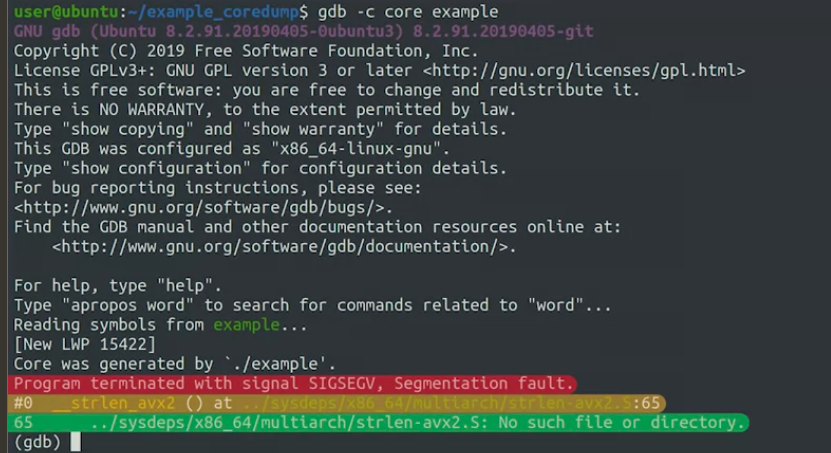

### GDB Tools
The gdb command will debug a core dump and stop where the failure was recorded.

What are those weird numbers starting with 0x? Those are hexadecimal numbers, and they are used to show addresses in memory where some data is stored.

***

kind of problem is common when dealing with applications written in languages like C or C++. On the flip side, when using languages like Python, we usually need to deal with unexpected exceptions making our program crash

traceback
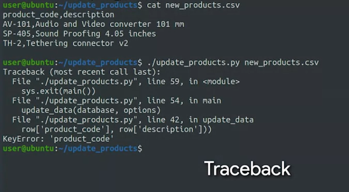

At the bottom, we see the name of the exception. In this case, Key Error and the message in this case, product code, which is the name of the key that's failing. 

Above that, we see a list of function calls with two lines per function. The first line tells us the Python file that contains the function, the line number, and the name of the function. 

The second line shows us the contents of that line. This information is similar to the back-trace that we saw in our last video. But the order of the functions is reversed. The function at the bottom, update data, is the one where the exception occurred

### pdb3
pdb untuk python 
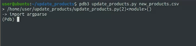

We could run each of the instructions in the file one by one using the next command. But there's a lot going on here. So we need to go through a lot of lines until we reach the failure. Alternatively, we can tell the debugger to continue the execution until it either finishes or crashes

tuliskan continue

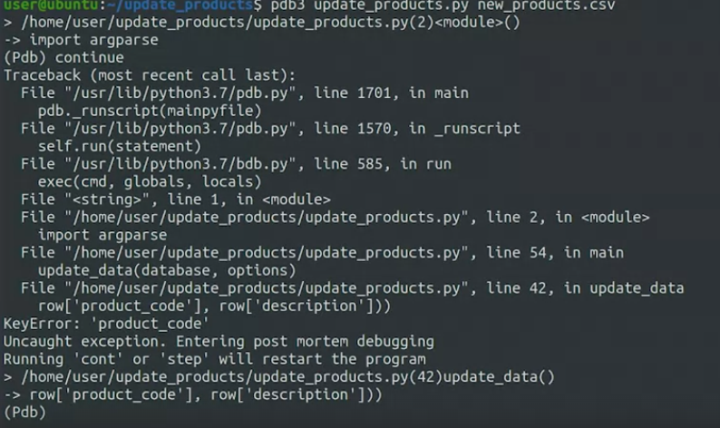

PDB memungkinkan debugging dengan interaktif

PDB3 memungkinkan pengguna untuk melakukan tugas-tugas berikut saat debugging:

Menempatkan breakpoint pada bagian kode yang diinginkan
Menjalankan kode hingga breakpoint tercapai
Mengeksplorasi nilai variabel dan ekspresi pada saat runtime
Mengubah nilai variabel saat runtime
Menjalankan kode baris per baris dan melihat bagaimana kode bekerja
Menganalisis stack trace dan mengidentifikasi masalah pada program

***

kesalahn umum karena salah memberikan tanda > atau => namanya adalah off-by-one-error

Pertanyaan #4
A very common method of debugging is to add print statements to our code that display information, such as contents of variables, custom error statements, or return values of functions. What is this type of debugging called? printf debugging

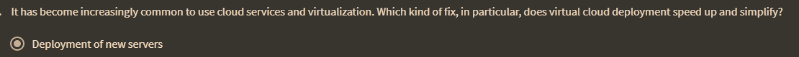

