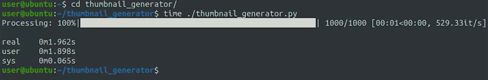
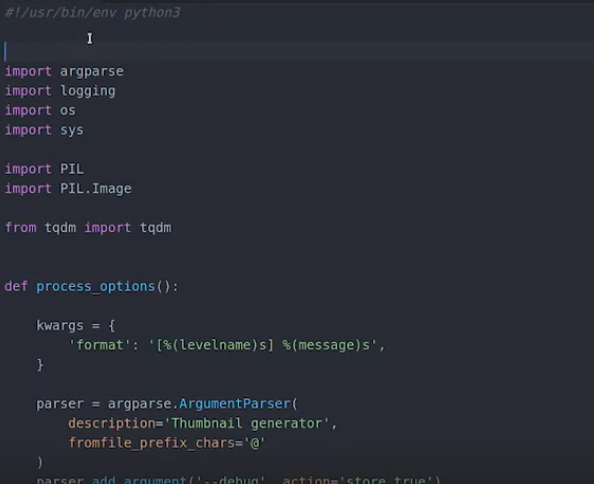
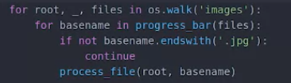
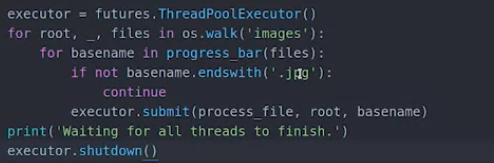
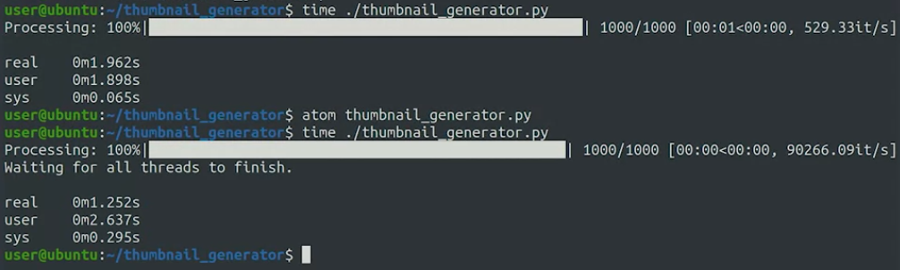
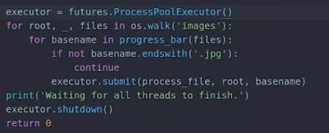
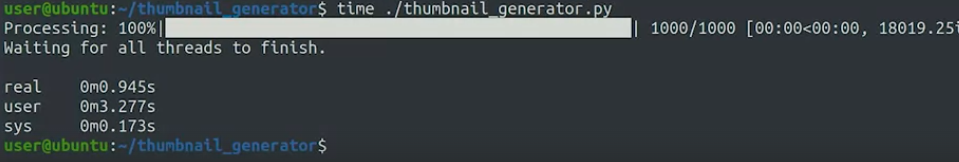
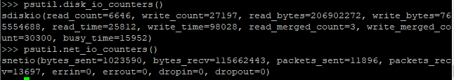

Because of how profilers work, they are specific to each programming language. So we would use gprof to analyze a C program but use the c-Profile module to analyze a Python program. Using tools like these, we can see which functions are called by our program.

How can we avoid expensive operations like parsing a file, downloading data over the network, or going through a long list? If the script gets executed fairly regularly, it's common to create a local cache. In an earlier video, we said that a cache is a way of storing data in a form that's faster to access than its original form. So if we're parsing a large file and only keeping a few key pieces of information from it, we can create a cache to store only that information.

pertanyaan yang perlu ditimbangkan untuk membaut cached agar mempercepat proses antara lain : This might be the case for data like how much memory was used on computers across the fleet over the last month? How many employees each department in a company has? Or how many units were sold of each product over the last quarter? 

## KCachegrind
is a profile data visualization tool, used to determine the most time consuming parts in the execution of a program.

***
## Concurrency
bagaimana menulis program  yang melakukan operasi secara paralel. 

Our OS handles the many processes that run on our computer. If a computer has more than one core, the operating system can decide which processes get executed on which core, and no matter the split between cores, all of these processes will be executing in parallel.  Each of them has its own memory allocation and does its own IO calls. The OS will decide what fraction of CPU time each process gets and switch between them as needed

So a very easy way to run operations in parallel is just to split them across different processes, calling your script many times each with a different input set, and just let the operating system handle the concurrency.

his allows threats to share some of the memory with other threads in the same process. Since this isn't handled by the OS, we'll need to modify our code to create and handle the threats

### Threading or AsyncIO
In Python, we can use the Threading or AsyncIO modules to do this. These modules let us specify which parts of the code we want to run in separate threads 

###  I/O bound	
if you want to use more processors, you'll need to split the code into fully separate processes. If your script is mostly just waiting on input or output, also known as I/O bound

### CPU bond
teknik untuk mengaitkan atau membatasi tugas-tugas tertentu pada CPU atau inti prosesor yang spesifik. Dalam sistem operasi yang mendukung paralelisme, tugas-tugas atau proses dapat dieksekusi secara bersamaan oleh beberapa CPU atau inti prosesor. Namun, jika beberapa proses yang berbeda sedang berjalan di CPU yang sama, bisa terjadi persaingan sumber daya dan kemungkinan terjadinya overhead. misalnya Sebuah aplikasi yang memerlukan pemrosesan yang intensif dapat diikatkan pada satu atau beberapa inti prosesor, sehingga memungkinkan CPU lainnya untuk melayani permintaan lain dari aplikasi yang berbeda

****
**SQLite** is a lightweight database system that lets you query the information stored in the file without needing to run a database server. atau anda bisa menggunakan file CSV sebagai database. you might need to add a caching service like Varnish. This would speed up the load of dynamically

atau anda menggunakan beberapa komputer untuk saling bekerja sama. 

***

sebuah e-commerce mungkin dibangaun dari beberapa komputer untuk melayani hal-hal yang berbeda beda. A system like this can be tricky to debug and understand

dibuat index agar mudah dicarinya.

***
membuat thumbnails agar mempercepat proses kedepanya. 

btw time itu berfungsi untuk mengetahui seberapa lama program membutuhkan waktu untuk di eksekusi

kurang lebih seperti ini kode generator thumbnailsnya

sekarang kita mencoba menggunakan threading apakah dapat mempercepat atau tidak. To be able to run things in parallel, we'll need to create an executor. This is the process that's in charge of distributing the work among the different workers. itu akan disedikan oleh modul futures

kita menggunakan ThreadPoolExecutor, dari yang sepertin ini

menjadi seperti ini

	from concurrent import futures

An interesting thing that happens when we use threads is that the loop will finish as soon as all tasks are scheduled. But it will still take a while until the tasks complete. So we'll add a message saying that we're waiting for all threads to finish, and then call the shutdown function on the executor. This function waits until all the workers in the pool are done, and only then shuts down the executor.

dan berikut adalah perbandinganya

 See how the user time is higher than the real time? By using multiple threads, our script is making use of the different processors available in the computer
 
 
What do you think will happen if we try to use processes instead of threads? Let's try. By changing the executor to the ProcessPoolExecutor, we tell the futures module that we want to use processes instead of threads for the parallel operations. Let's save and try this one out now.

dan itu lebih cepat.  This is because, by using processes, we're making even more use of the CPU

for more : [*](https://realpython.com/python-concurrency/)

***

CPU bound means the program is bottlenecked by the CPU (Central Processing Unit). When your program is waiting for I/O (e.g., disk read/write, network read/write), the CPU is free to do other tasks, even if your program is stopped. The speed of your program will mostly depend on how fast that I/O can happen; if you want to speed it up, you'll need to speed up the I/O. If your program is running lots of program instructions and not waiting for I/O, then it's CPU bound. Speeding up the CPU will make the program run faster.

In either case, the key to speeding up the program might not be to speed up the hardware but to optimize the program to reduce the amount of I/O or CPU it need

#### pseutil
psutil (process and system utilities) is a cross-platform library for retrieving information on running processes and system utilization (CPU, memory, disks, network, sensors) in Python.

Di sini, Anda memiliki CPU dengan banyak core; ini berarti satu utas CPU/inti virtual yang terisi penuh sama dengan 1,2% dari total beban. Jadi, ini hanya menggunakan satu inti CPU terlepas dari memiliki banyak inti.

using psutil.disk_io_counters() and psutil.net_io_counters() you'll get byte read and byte write for disk I/O and byte received and byte sent for the network I/O bandwidth

so you noticed the amount of byte read and byte write for disk I/O and byte received and byte sent for the network I/O bandwidth.

## rsync
rsync(remote sync) is a utility for efficiently transferring and synchronizing files between a computer and an external hard drive and across networked computers by comparing the modification time and size of files. One of the important features of rsync is that it works on the delta transfer algorithm, which means it'll only sync or copy the changes from the source to the destination instead of copying the whole file. This ultimately reduces the amount of data sent over the network.

contoh kasus :
in order to efficiently back up parallelly, use multiprocessing to take advantage of the idle CPU cores. Initially, because of CPU bound, the backup process takes more than 20 hours to finish, which isn't efficient for a daily backup. Now, by using multiprocessing, you can back up your data from the source to the destination parallelly by utilizing the multiple cores of the CPU.

