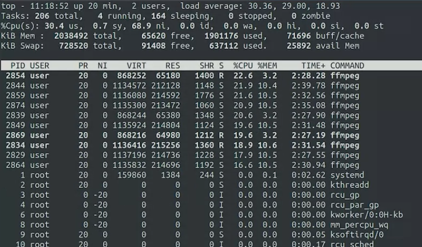
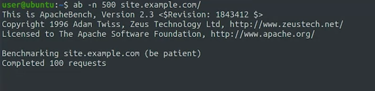
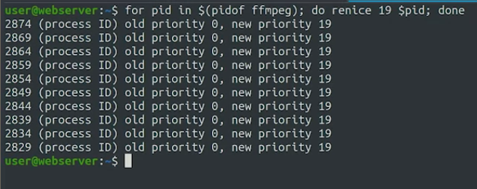

CPU diambil bagianya oleh beberapa proses. So if the problem is that your program needs more CPU time, you can close other running programs that you don't need right then. If the problem is that you don't have enough space on disk, you can uninstall applications that you don't use, or delete or move data that doesn't need to be on that disk and so on. 

salah satu tool untuk menujukkan kinerja hardware adalah top

disitu ditampilkan PID, itu bisa untuk menghentikan dari terminal yang berbeda dengna menunjukkan PID terkait. 	

 ***
 bagaimana komputer menggunakan sumber daya
 
 
 dalam ram, aplikasi akan cepat karena
 
 
 dalam disk lebih lambat daripada ram
 
 
 apalagi dalam network 
 
 
 
 
 komputer yang lambat juga dapat diakibatkan karena ada software software rusak. atau karena malware juga bisa. 
 
 *** 
 mengecek website apakah berfungsi dengan seharusnya atau tidak dapat mengetikkan perintah berikut di terminal. 
 
 
 
 
 
 diatas adalah merubah prioritas, ffmept memakan resource banyak, maka kita otak atik dengan perintah pidof
 
 prioritas dalam linux direpresentasikan dari angka 0 ke angka 19. tetapi kita bisa mengubahnya untuk suatu proses tertentu yang kita inginkan. 
 
 ffmeg sudah tidak menjadi prioritas lagi. 
 
 gunakan perintah berikut
 
 pipeline less digunakan agar bisa di scrolldown
 
 kemudian pilih /ffmeg
 
 kasus diatas adalah ketika linuxmu menghosting website, dan website itu pelan, maka anda mencoba untuk memprioritaskan hosting linux.
 
 sepertinya tepatnya adalah mengalokasikan memori ffmeg. 