the computer might write data to some part of the memory and then get a totally different value when trying to read it back. To check the health of our RAM, we can use the memtest 86 tool to look for errors.

hal yang pertama di cek mungkin bisa hardware terlebih dahulu, baru itu software misalnya OS

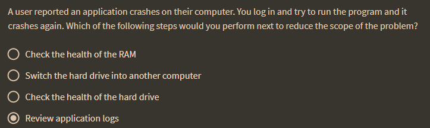

To look at logs on Linux will open the system log files and VAR log or the user log files and dot accession errors file. On Mac OS we generally use the console app to look at logs and the event Viewer on Windows. 

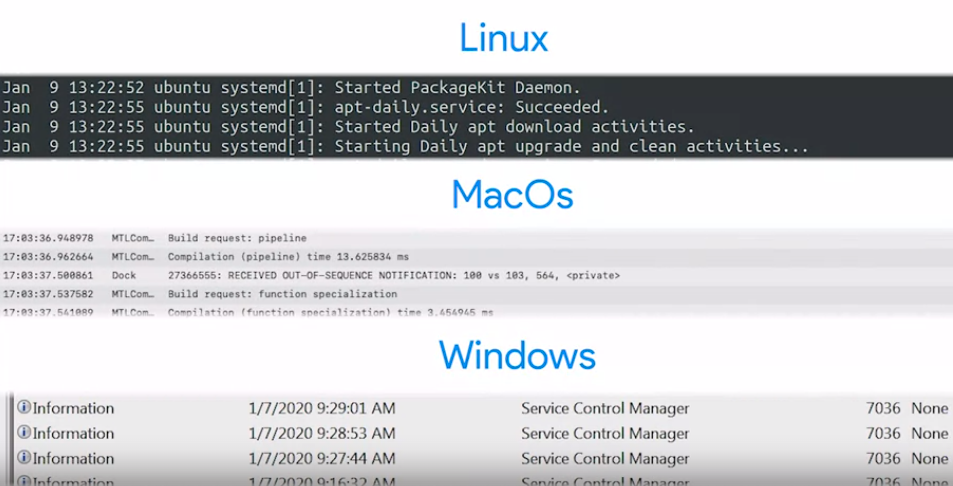

Sometimes the errors will be self-explanatory like permission denied no such file or directory connection refused

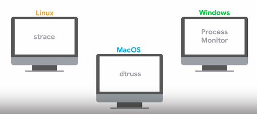

On Linux we use S Trace to see what system calls a programs doing. The equivalent tool is called de trois on Mac OS process monitor is a Windows tool that can also take a peek inside what's going on inside a process.

When trying to figure out what changed logs can also be a useful source of information.

 If the settings are managed through a configuration management system and the values are stored in a Version Control System. Then you might be able to look at the history of changes and figure out which one triggered the failure
 
 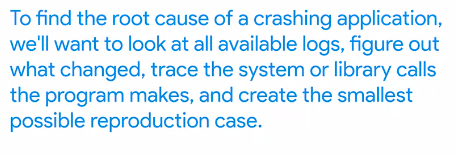
 
Some of your systems generate data in XML format which used to work fine with the previous version of the software but the new version now requires all data to be in a YAML format. In this case you can write a script that pre-processes the data and make sure that it's in the format that the program expects.

you might want to check what environment the applications developers recommend and then modify your systems to match that. This could be running the same version of the operating system using the same version of the dynamic libraries or interacting with the same back end services

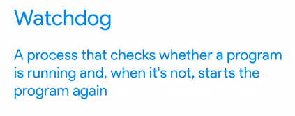

As we called out on Linux systems, logs are located in var/log. we'll use the date command to check the current date. Let's change into that directory and check out if there are any recent logs about our error and then the Ls -Lt command which sorts the files by the last modified date connecting it to the head command to keep the top 10 lines. 

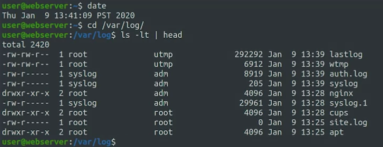

***

misalnya kasus web server anda error, dan anda ingin memperbainya

diatas tidak ada informasi menarik, atau dengan 

	| tail

itu sama saja tidak ada yang menarik
kita tahu bawha web berjalan di port 80, We can use the netstat command which can give us a bunch of information about our network connections depending on the flags we pass. 

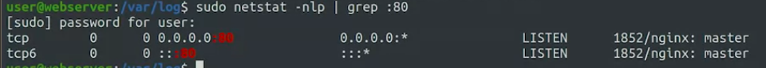

 We see that the process listening in port 80 is called "nginx". 
We now want to check out the configuration for our site. Configuration files on Linux are stored in the etc directory. So let's look at etc/nginx.

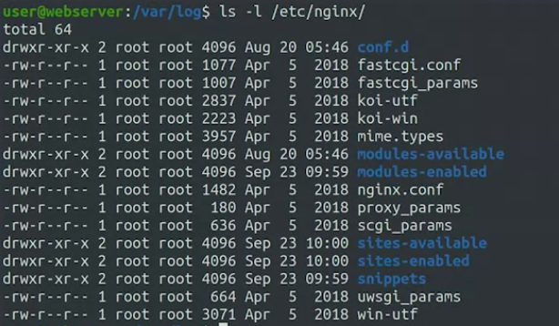

masuk kesini

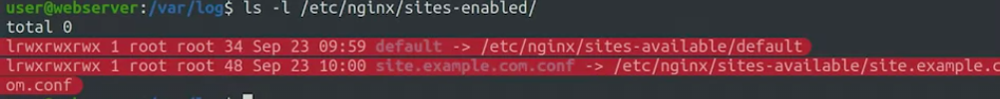

kemudian kita buka yang nomor dua itu

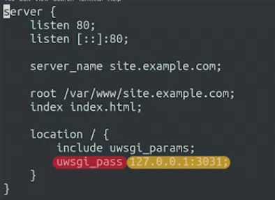

There's not a lot here, but at the bottom we see that it says uwsgi_pass, and then the local host address followed by a different port number. It seems that this website isn't being served directly from nginx, instead, the software is passing the control of the connections to uWSGI which is a common solution used to connect a Web server to programs that generate dynamic pages. So let's see if we can find the configuration for that one. We'll exit VI with a colon q and then see if there's anything interesting in etc/uwsgi. Here we only see two directories, apps-available and apps-enabled. Let's say it's an apps-enabled.
Putar video mulai dari :4:44 dan ikuti transkrip4:44
Cool. We found the uWSGI configuration for our site. Let's check it out.

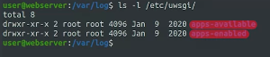

setelah menelusuri, kita mendapatkan suatu file yang terkait, dan bisa menghidupkan fungsi 

debug()

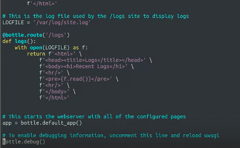

kita restart servicenya

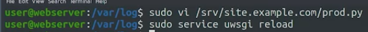

kemudian kita jalankan webnya lagi

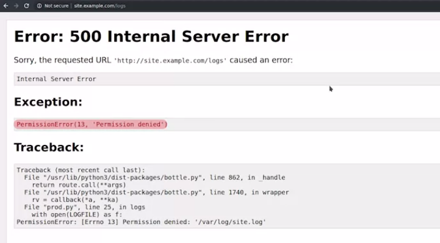

owh ternyata itu. dan kamu tahu kan, kalau php sendiri sebagai contoh, bisa tidak menampilkan pesan error dengan suatu fungsi kan.

***

The /var/log directory is where application logs may be stored.  

a common location to view configuration files for a web application running on a Linux server is **/etc/< app folder >**

