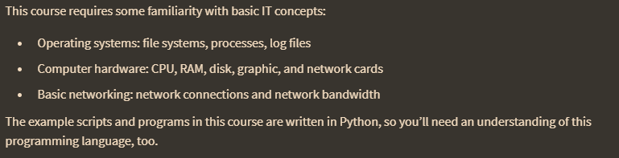
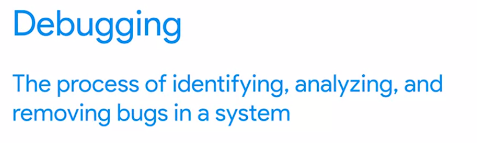
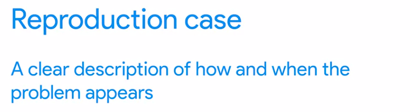
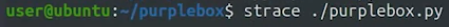
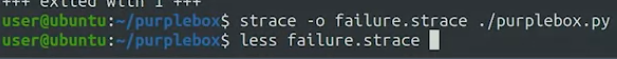
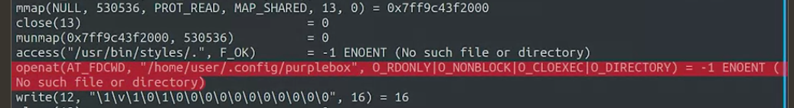

we'll look at different ways that we can approach understanding what's going on and finding the root cause of an issue, including using a process ***called binary*** search to troubleshoot problems.

"Bug" merujuk pada kesalahan dalam kode yang menyebabkan program tidak berfungsi seperti yang diharapkan. Bug bisa terjadi karena kesalahan sintaksis, kesalahan logika, atau masalah pada lingkungan program

Trobleshooting
dilakukan pada tingkat yang lebih tinggi atau abstrak, dengan tujuan menemukan dan mengidentifikasi masalah serta melibatkan analisis.

Debugging
dilakukan untuk mencari dan mengidentifikasi kesalahan atau bug pada kode program yang lebih spesifik dan terfokus. melibatkan langkah-langkah teknis

## Tools
Tools like tcpdump and Wireshark can show us ongoing network connections, and help us analyze the traffic going over our cables. ools like ps, top, or free can show us the number and types of resources used in the system. We can use a tool like strace to look at the system calls made by a program, or ltrace to look at the library calls made by the software. 

1. The first step is getting information
2. Finging the root cause
3. Melakukan perbaikan yang diperlukan

### Strace
alat ini memungkinkan melihat apa yang dilakukan program. misalnya ini

outputnya 
use the- 0 flag of the astrois command to store the output into a file

dari atas dapat diketahui bahwa the application tries to open a directory called .config purple box, which doesn't exist.

## Strace
 utilitas pada sistem operasi Linux yang digunakan untuk memantau sistem panggilan (system calls) dan sinyal yang dilakukan oleh sebuah program. dia mencatat seluruh interaksi program dengan sistem operasi. 
 
Strace dapat membantu mengidentifikasi masalah seperti:

1. Kesalahan saat membuka atau menutup file
2. Kesalahan saat melakukan operasi I/O (Input/Output) pada file
3. Kesalahan saat melakukan alokasi memori, dll.

gunakan 

	strace ./script.py | less  

agar tidak terlalu panjang. 