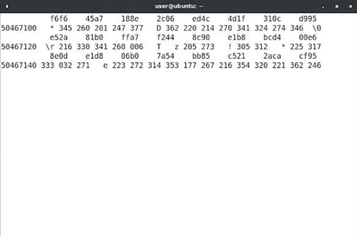
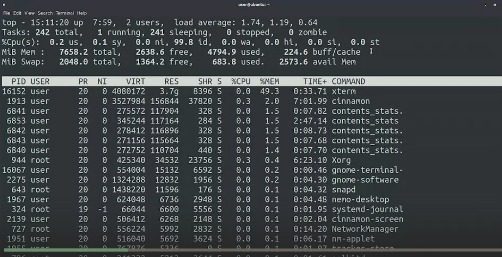
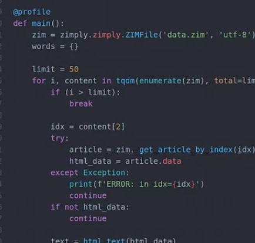
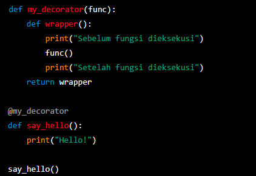
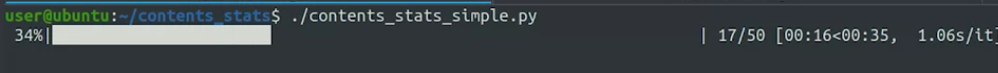
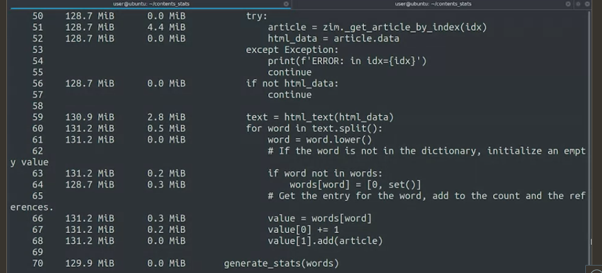

we'll explore how we can figure out what's going on with programs that exhaust resources on our computer. Whether that's memory, disk, or even network link 	

 When writing programs in languages like C, or C plus plus, the programmer is in charge of deciding how much memory to request, and when to give it back
 
 
 
 memory leak
 atau kebocoran memori adalah ketika sebagian memori yang tidak diperlukan lagi tidak dilepaskan. But, when the memory that's leaked becomes larger and larger over time, it can cause the whole system to start misbehaving (berperilaku buruk)
 
 dalam bahasa python, java atau golang, memori telah diatur untuk kita
 
 
 
 The OS will normally released any memory assigned to a process once the process finishes.
 
Even worse than these, are memory leaks caused by a device driver, or the OS itself. In these cases, only a full restart of the system releases the memory. mungkin akan sangat terasa untuk aplikasi yang berjalan di latar belakang

> sebab itu mungkin, OS selalu meminta pembaruan.

## mencurigai adanya kebocoran memori
We can use a memory profiler to figure out how the memory is being used.

1. For profiling C and C plus plus programs, we'll use Valgrind
2. For profiling a Python, there are bunch of different tools that are disposal, depending on what exactly we want to profile

The goal of these tools is to help us identify which information we're keeping in memory that we don't actually need

***
Programs may need disk space for lots of different reason, like
 
 
 
 the OS might keep trying to start a program that fails because of a configuration problem. This will generate a new log entry with every retry, and can take up a lot of space if there are several retries per second, or it could be that the server has a lot of activity and the logs are real
 
 In other cases, the disk might get full due to a program generating large temporary files, and then failing to clean those up.
 
 
 
 latency and bandwidth saling interact
 
 
 so for a website of about one megabyte of content, that large initial latency will be noticeable, since it's an extra 20 percent on top of the total time to download it.
 
 But if the content is 10 megabytes or more, the initial latency will be less than five percent of the total time to download it.
 
 jika dalam data yang besar, mungkin latensi tidak begitu berpengaruh ya, tetapi jika dalam data yang kecil latensi menjadi faktor yang besar
 
 ## iftop
 If you've ever run several applications using the same network at once, the overall connection speed may have seem slower. You can check out which processes are using the network connection by running a program like iftop.
 
 
 
there are limits to how many connections a single server can have, which will prevent new connections.  

## uxterm
Scroll buffer adalah, misalnya dalam terminal itu mencetak outpu, dan terminal itu terus mengikuti ouput tersebut (dengan scorll down terus menerus)

The contents of the buffer are kept in memory. So if we make it really long and we managed to fill it, will cause our computer to run out of memory. misalnya command yang menghasilkan scroll buffer adalah 

	 od-cx/dev/urandom
	 

ketika kita menghentikan scroll buffer tersebut dengan control + c, memori masih di alokasikan untuk itu

dari gambar diatas, memori yang paling banyak digunakan adalah oleh exterm

The column labeled RES is the dynamic memory that's preserved for the specific process. The one labeled SHR is for memory that's shared across processes, and the one labeled VIRT lists all the virtual memory allocated for each process. This includes; process specific memory, shared memory, and other shared resources that are stored on disk but maps into the memory of the process. It's usually fine for a process to have a high value in the VIRT column. The one that usually indicates a problem is the RES column. 

dapat dilihat kan, ada program yang masih mengalokasikan memori untuknya. contoh lebih ekstrem adalah ketika memori leaks terus bertumbuh, tidak awalnya kecili tak terlihat tetapi semakin menjadi besar

> memori leaks dapat diatasi dengan restart program, karena itu menata ulang memori memori yang diperlukan. memori leaks dapat terjadi karena suatu program atau OS itu sendiri

 it might be hard to tell the difference between memory that's actually needed and memory that's being wasted
 
 > cara menampilkan alokasi alokasi memori pada linux adalah ` top `

so we could use the help of a memory profiler here to figure out what the problem is. Let's stop it now and use a profiler to figure out where our computer's memory is going

dibawah ini contoh memori profiler untuk python (dari sekian banyak modul profiler di python) 

diatas, dekoratornya adalah @profile
def main(): ...

contoh penggunaan decorator simple

oke kembali ke topik
dan ini ketika dijalankan 

Kami menjalankan skrip (yang tadi ada kebocoran) dengan profiler memori diaktifkan. Ini hanya membaca 50 artikel (tugas asli dari script) tetapi butuh banyak waktu karena semua profil memori itu membuat skrip kita lebih lambat.

hasilnya adalah seperti ini

The first column shows us the amount of memory required when each line gets executed. The second one shows the increase in memory for each specific line. We see here that after going through 50 articles, the program already took 130 megabytes

Kita dapat melihat bahwa variabel yang paling banyak membutuhkan memori adalah artikel dan teks, masing-masing sekitar empat dan tiga megabyte. Itu adalah artikel yang sedang kami proses, dan tidak apa-apa bagi artikel tersebut untuk mengambil tempat saat kami menghitung kata dalam artikel. Tapi begitu selesai memproses satu artikel, kita tidak boleh menyimpan memori itu. Bisakah Anda menemukan masalahnya?

Tepat di bagian akhir, kode menyimpan artikel untuk menyimpan referensi, tetapi menyimpan seluruh artikel. Jika kita ingin menyimpan referensi ke semua artikel yang menyertakan kata, kita dapat menyimpan judul atau entri indeks, tentunya bukan seluruh konten. Masih banyak lagi yang bisa dikatakan tentang manajemen memori dan profil memori yang tidak sempat kami bahas di sini

