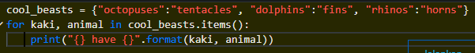
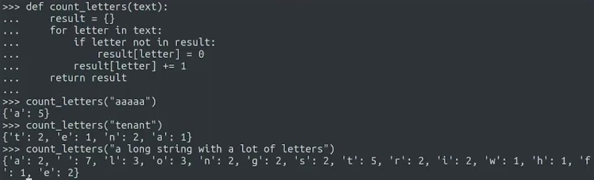

## perulangan di dictionary

.items() adalah untuk mengambil pasangan dari semua kunci

perulangan digunakan untuk seperti kebalikanya items()

If you only wanted to access the keys in a dictionary, you could use the keys() method on the dictionary: dictionary.keys(). If you only wanted the values, you could use the values() method: dictionary.values().

dictionary dapat menyimpan lebih dari satu value untuk satu key
my_dictionary = {keyA:[value1,value2], keyB:[value3,value4]}