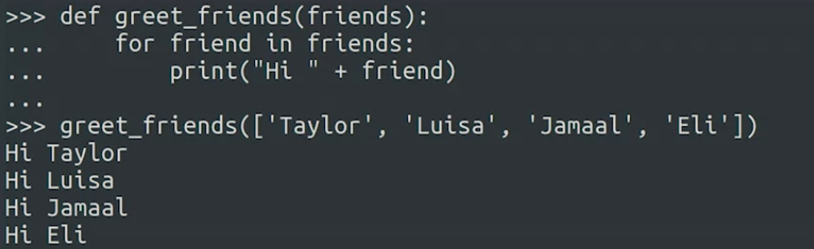
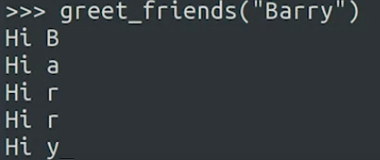

The range() function can take up to three parameters:  range(start, stop, step). The third item in the range() function parameters is the incremental step value. The default increment is +1. The default value can be overridden with any valid increment.  if you have a loop with the range: for n in range(1, 5, 6), the range will only produce the numeric value 1. This is because the incremental value of 6 exceeded the ending point of the range.

	for x in range(2, -2, -1):
		print(x)
	# The loop should print 2, 1, 0, -1
	
nested loop adalah loop yang berada didalam loop. penggunaan loop tanpa range

baik for loop dan while loop both can be used with the keywords break and continue