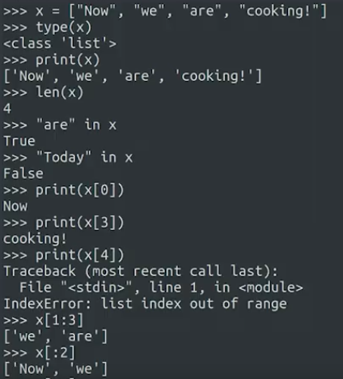
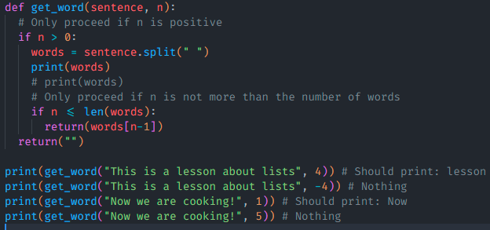
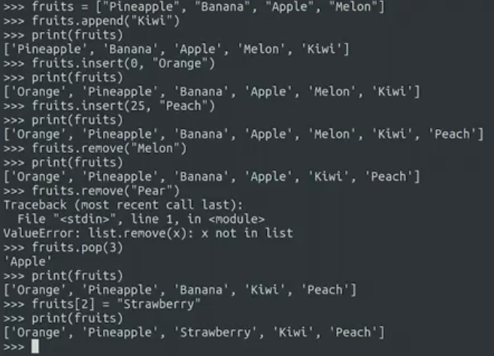

words[:n] akan mengembalikan sublist dari elemen words dari indeks awal sampai sebelum indeks n. Ini berarti, elemen pada indeks n tidak akan termasuk dalam sublist tersebut. Jadi, jika n adalah 3, maka words[:n] akan mengembalikan sublist dari elemen pada indeks 0, 1, dan 2.

words[n:m] akan mengembalikan sublist dari elemen words dari indeks n hingga sebelum indeks m. Ini berarti, elemen pada indeks m tidak akan termasuk dalam sublist tersebut. Jadi, jika n adalah 3 dan m adalah 6, maka words[n:m] akan mengembalikan sublist dari elemen pada indeks 3, 4, dan 5.

words[:n] dan words[:n] sebenarnya adalah hal yang sama, yaitu keduanya akan mengembalikan sublist dari elemen words dari indeks awal sampai sebelum indeks n. Jadi, words[:n] dan words[:n] dapat digunakan secara bergantian.

contoh penggunaan

(index out of range )

list.split() sebenarnya secara default adalah list.split(" ")

ini mirip tetapi akan error di pemanggilan fungsi ke empat

## Manipulasi list

