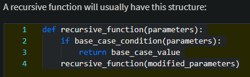

rekursif adalah fungsi yang memanggil dirinya sendiri. contohnya

	def sum_positive_numbers(n):
    	# The base case is n being smaller than 1
    	if n < 1:
      	  return 0

    # The recursive case is adding this number to 
    # the sum of the numbers smaller than this one.
    	return n + sum_positive_numbers(n-1)

	print(sum_positive_numbers(3)) # Should be 6
	print(sum_positive_numbers(5)) # Should be 15
	
contoh aplikasi misalnya dalam mengecek jumlah folder dalam subfolder, atau dalam matematika misalnya factorial

