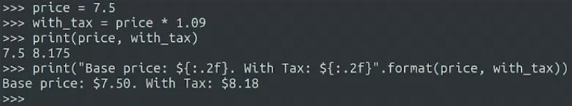
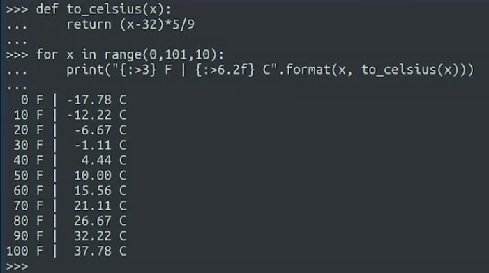

untuk menampilkan string bisa menggunakan mekanisme string format misalnya

	print ('hai {}'.format('bro'))

atau dengan cara lain, yaitu mirip dengan sintaks C/C++ menggunakan operator % yang ditambahkan dengan "argument spesifik" misalnya %s dan %d. 

	nama = "Dicoding"
	print("Halo, %s!" % nama)
	# output Halo, Dicoding
	
menggunakan %d dan %s

	nama = "Dicoding"
	umur = 5
	print("Umur %s adalah %d tahun." % (nama, umur))
	
berikut penjelasan argument spesifik

>%s - String

>%d - Integers

>%f - Bilangan Desimal

>%.< digit >f - Bilangan desimal dengan sejumlah digit angka dibelakang koma.

>%x/%X - Bilangan bulat dalam representasi Hexa (huruf kecil/huruf besar)

misalnya

{:d} integer value
'{:d}'.format(10.5) → '10'

{:.2s} string value
{:.2s}.format('anam') → 'an'

{:^6s} string centered in that many space

### formatting expression
penggunaan .format dengan berbagai aplikasi lain

:.2f dinamakan dengan formatting expression 
dimana 
:  -> tempat angka berada (dimulai)
2f -> mengekspresikan float dengan dua titik

atau misal contoh seperti berikut

'> digunakan untuk memberi tahu Python bahwa nilai harus diposisikan secara rata kanan dalam kolom dengan lebar tertentu.
6 menunjukkan bahwa kolom tersebut harus memiliki lebar 6 karakter.
.2f digunakan untuk menunjukkan bahwa nilai float harus diformat sebagai bilangan desimal dengan 2 digit setelah titik desimal.

format juga dapat dilakukan sebagai berikut

	'halo {1}, dada dan {0}, hai {3}'.format(x, y, z)'

output

	halo y, dada dan x, hai z
	

## command line argument

python memungkinkan memanggil skrip.py dengan ditambahkan parameter tertentu

	$ python test.py arg1 arg2 arg3
	
hal ini difasilitasi module sys python, sehingga perlu memanggil modul tersebut dahulu

	import sys

sys.argv yang memuat seluruh argumen yang diterima

	import sys
	print(len(sys.argv))
	print(str(sys.argv))
	print(sys.argv[0])
	
input

	$ python test.py arg1 arg2 arg3
	
output

	4
	['test.py', 'arg1', 'arg2', 'arg3']
	arg1

## dynamic typing
python tidak akan mengecek jika kode tersbut tidak terekseki, misalnya

	if False:
		print( 1 + 'halo')
	else:
		print ('lewat')	
		
output

	lewat

## transformasi value
boolean untuk memvalidasi suatu awalan pada string

	print('Di esia'.startswith('Di'))
	# output: True
	
atau bisa menggunakan endswith()