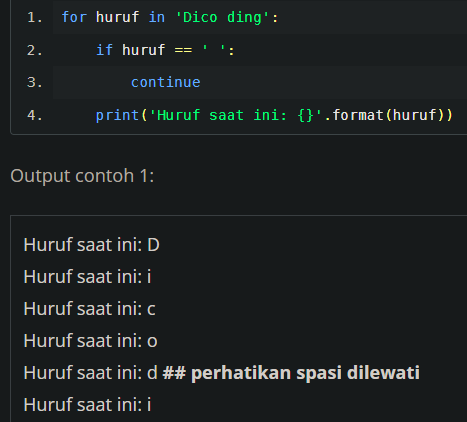

## Ternary operator 
atau dikenal sebagai conditional expressions pada Python. contoh
	
	kondisi = True
	print(2 if kondisi else 1/0)
	
penulisan ini dihindari karena membingungkan kecuali untuk kode yang pendek

## ShortHand Ternary
membantu minimal memberikan informasi relevan saat error

	hasil = None
	pesan = hasil or "Tidak ada data"
	print(pesan)
	
	# output: tidak ada data

***

	for x in 'Dicoding':
		print('ini: {}'.format(x))
	
	 # output:
	 ini:D
	 ini:i
	 ini:c
	 ...
	 
	
parameter end untuk mengatur karakter yang mengakhiri pencetakan string bisanya berguna dalam looping, misal

	for i in range(0, 6):
		for j in range(0, 6 - i):
			print('*', end='')
			
## continue
berguna untuk melewati ketika kondisi terpenuhi

## Else setelah For
berguna untuk perulangan yang bersifat pencarian - untuk memberikan jalan keluar program saat pencarian tidak ditemukan

	for item in items:
		if cari(item):
			proses_item()
        break
	else:
		not_found_in_container()
		
 Ada If dan Else, namun dalam tingkatan yang berbeda, apakah mereka terkait? 
 
Saat sebuah perulangan dijalankan, fungsi if akan dievaluasi. Saat ia pernah sekali saja benar, maka else tidak akan dieksekusi. Dengan kata lain, if yang berada dalam perulangan harus __selalu salah__ untuk memicu blok statemen else dijalankan

## Else setelah while
blok statement else akan selalu dieksekusi saat kondisi pada while menjadi salah

## pass
Digunakan jika Anda menginginkan sebuah pernyataan atau blok pernyataan (statement), namun tidak melakukan apapun. Pass statement adalah operasi bersifat Null (kosong) sehingga tidak menimbulkan error

	def sebuahfungsi():
		pass

## list comprehension

	for a in list1:
		for b in list2:
			if a == b:
				tampung.append(a)

bisa disingkat sebagai berikut 

	duplikat = [a for a in list1 for b in list2 if a == b]

## variabel underscore
a garis bawah (underscore) termasuk penamaan variabel yang valid. Secara umum "_" biasa digunakan sebagai throwaway variable (variabel tidak penting).  misalnya digunakan sebagai berikut untuk perulangan

	small_list_a = [_.lower() for _ in list_a]
	
dimana _ sebenarny bisa diganti apapun itu.