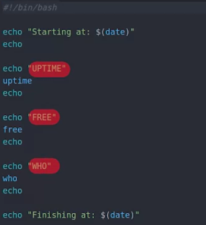
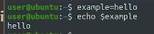
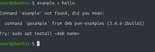
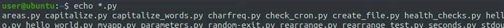
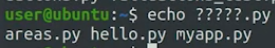
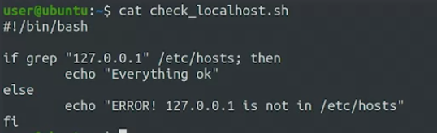
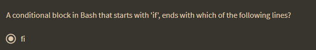
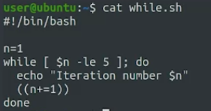
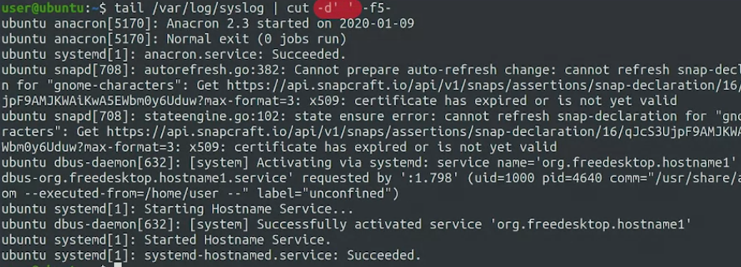
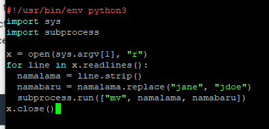

diatas adalah kode bash. shelbang menujukkan bahwa script ini perlu dijalankan oleh bash. line line tersebut jika tidak di enter (dibawahnya) bisa dipisahkan dengan semicolon (;) seperti pada python. dalam bahasa bash We can assign variables, new conditional operations, execute loops, defined functions, and so much more. yang diatas tadi adalah variable lingkungan (environt variable) sistem, sehingga ketika dipanggil sudah bisa menampilkan STDOUT nya. 

make variable

spasi berpengaruh

menunjukkan semua *

dengan mencari jumlah karakternya

seperti yang disebutkan dalam python testing 

pengkondisian dalam bash 

## Looping in bash

diatas adalah memutus sebagian log yang dilaporkan dengan cut. kemudian menggunakan pipeline untuk mengambil yang penting penting saja

bash tidak sevleksibel python

	if [ $n -le 9 ]; then
		# action to take when n is less than or equal to 9
	
	

contoh pengunnaan subprocess subproses subprosess
